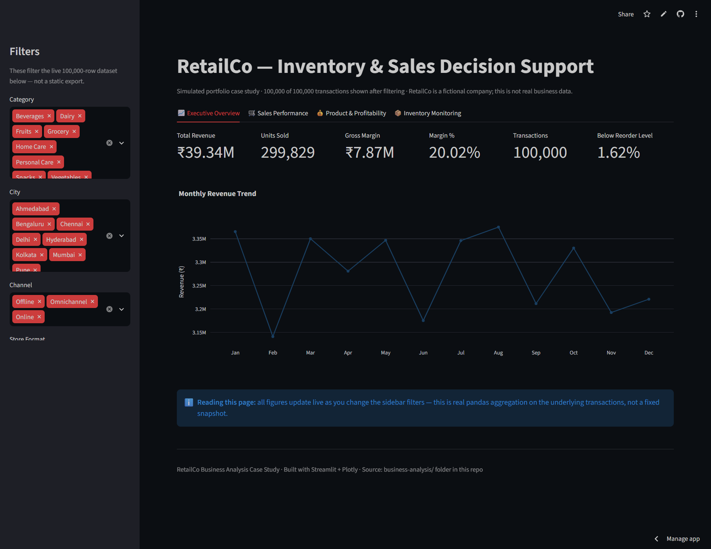
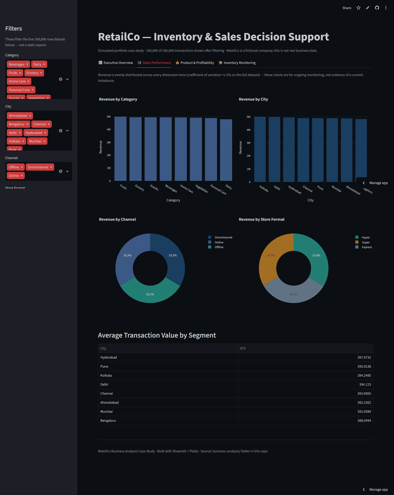
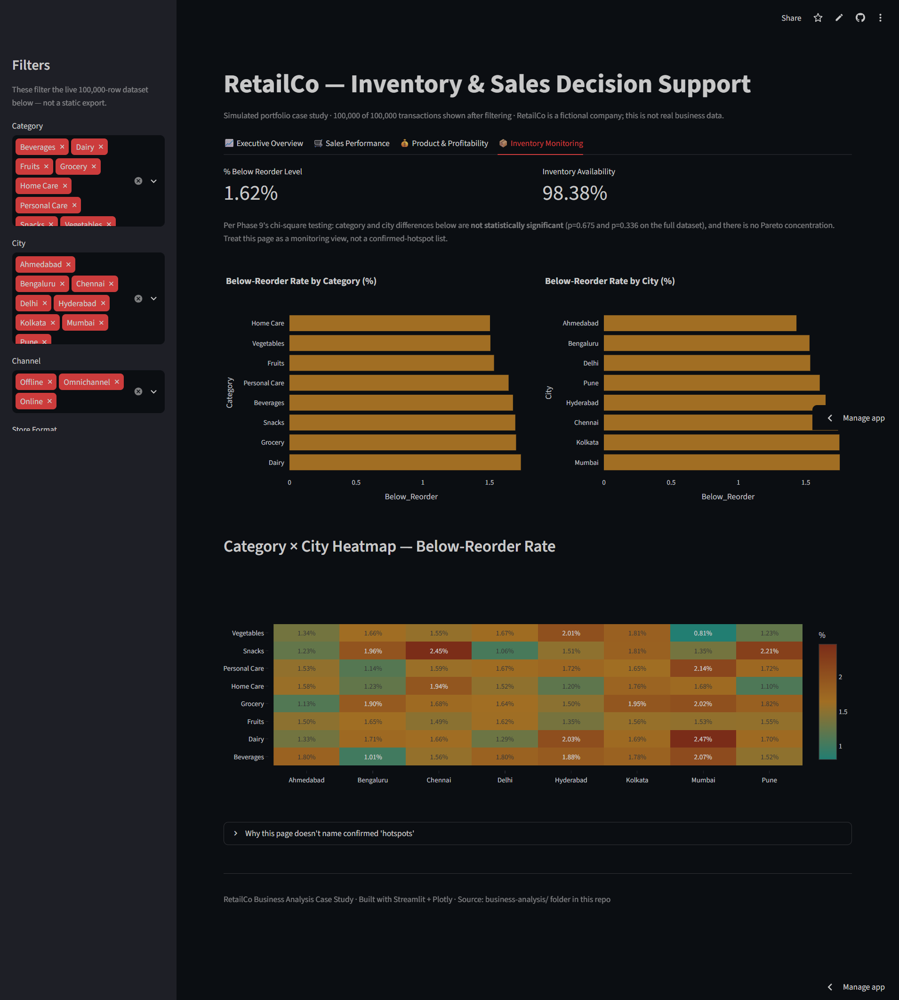

# 🏪 Retail Sales & Inventory Optimization

### End-to-End Business Analysis Case Study

<p align="center">
  
  
  
  
</p>

<p align="center">
  
  
  
  
</p>

> **Independent Business Analysis Case Study**
>
> A simulated FMCG retail environment created to demonstrate how a Business Analyst can move from **business concern → evidence → analysis → requirements → process design → decision support**.

**Important:** RetailCo, its stakeholders, operational processes and business concerns are simulated. The dataset is synthetic. No real employment, client engagement, stakeholder interview, implementation or realized business result is claimed.

---

# 🚀 Live Dashboard

## [▶️ Open the Live RetailCo Dashboard](https://retailco-sales-inventory.streamlit.app/)

An interactive **Streamlit + Plotly decision-support dashboard** built from the 100,000-row transaction dataset.

### What can be explored

* Executive KPIs
* Monthly revenue trends
* Revenue by category
* Revenue by city
* Revenue by channel
* Revenue by store format
* Margin analysis
* Inventory monitoring
* Category × City inventory signals
* Interactive filtering by:

  * Category
  * City
  * Channel
  * Store Format
  * Month range

<p align="center">
  <a href="https://retailco-sales-inventory.streamlit.app/">
    
  </a>
</p>

> **Recruiter note:** The dashboard is a portfolio decision-support prototype, not a production retail system.

---

# 📸 Dashboard Preview

## Executive Overview

<p align="center">
  
</p>

The executive view provides high-level KPIs and revenue trends intended to support management-level monitoring.

---

## Sales Performance

<p align="center">
  
</p>

The sales view allows comparison across categories, cities, channels and store formats.

---

## Inventory Monitoring

<p align="center">
  
</p>

The inventory view focuses on below-reorder monitoring and exception visibility while avoiding unsupported claims about stockouts or operational shortages.

---

# 💼 Why This Project Matters

This case study demonstrates an **end-to-end Business Analysis workflow**, rather than simply demonstrating data visualization or technical tools.

| Area                         | What the project demonstrates                                                          |
| ---------------------------- | -------------------------------------------------------------------------------------- |
| **Business Analysis**        | Problem framing, stakeholder analysis, business questions and evidence-based decisions |
| **Data Analytics**           | Python, Pandas, SQL, statistical testing and exploratory analysis                      |
| **Requirements Engineering** | Business requirements, functional requirements, user stories and acceptance criteria   |
| **Process Analysis**         | As-Is / To-Be process modeling and exception handling                                  |
| **Decision Support**         | KPI framework, dashboard requirements and interactive Streamlit dashboard              |
| **Solution Thinking**        | Solution evaluation, prioritization and executive recommendation                       |
| **Quality & Governance**     | Data-quality assessment, limitations, traceability and UAT planning                    |

### The BA story

```text
Business Concern
       ↓
Business Question
       ↓
Evidence
       ↓
Analysis
       ↓
Finding
       ↓
Requirement
       ↓
Solution
       ↓
Decision Support
```

The project intentionally demonstrates that a BA should be willing to **reject an unsupported assumption** rather than force the evidence to support the original business concern.

---

# 📌 Project at a Glance

|                   |                                                                                      |
| ----------------- | ------------------------------------------------------------------------------------ |
| **Project Type**  | Independent Business Analysis Portfolio Case Study                                   |
| **Industry**      | FMCG / Retail                                                                        |
| **Data**          | 100,000 synthetic transaction records                                                |
| **Period**        | 2024                                                                                 |
| **Primary Focus** | Business Analysis + Data Analytics + Decision Support                                |
| **Analysis**      | Python, Pandas, SQL, statistical analysis                                            |
| **Requirements**  | Business requirements, functional requirements, user stories and acceptance criteria |
| **Process**       | As-Is / To-Be process modeling                                                       |
| **Dashboard**     | Streamlit + Plotly                                                                   |
| **Testing**       | UAT planning                                                                         |
| **Status**        | Core BA analysis complete                                                            |
| **Live Demo**     | [Open RetailCo Dashboard](https://retailco-sales-inventory.streamlit.app/)           |

### Core competencies demonstrated

`Business Analysis` · `Requirements Engineering` · `Data Analysis` · `Process Modeling` · `KPI Design` · `Root Cause Analysis` · `Decision Support` · `UAT` · `Python` · `SQL` · `Streamlit`

---

# 🎯 What This Case Study Demonstrates

The objective was to demonstrate **how I think as a Business Analyst**, rather than simply showing technical outputs.

I started with simulated management concerns, converted them into business questions, tested them against available evidence, identified which assumptions were supported or unsupported, and translated the validated opportunity into BA artifacts and decision-support requirements.

## Complete BA Evidence Chain

```text
Business Concern
      ↓
Business Questions
      ↓
Data Discovery & Quality
      ↓
Performance Analysis
      ↓
KPI Framework
      ↓
Root Cause Analysis
      ↓
As-Is Process
      ↓
Requirements
      ↓
User Stories & Acceptance Criteria
      ↓
To-Be Process
      ↓
Solution Evaluation
      ↓
Dashboard Requirements
      ↓
UAT Planning
      ↓
Executive Recommendation
```

---

# 🔎 Executive Findings — What the Analysis Actually Found

The most important part of this case study is not the number of files.

It is the **decision-making process**.

Three initial stakeholder concerns were tested against the available data:

| Initial Business Concern                                     | Evidence-Based Result                                                                                         | BA Decision                              |
| ------------------------------------------------------------ | ------------------------------------------------------------------------------------------------------------- | ---------------------------------------- |
| High-revenue products have weak margins                      | ❌ **Not supported**                                                                                           | Do not prioritize margin optimization    |
| Inventory risk is concentrated in specific categories/cities | ⚠️ **Descriptive differences exist, but statistical evidence does not confirm a significant hotspot pattern** | Investigate exception visibility further |
| Supplier lead time drives inventory risk                     | ❌ **No meaningful relationship observed**                                                                     | Do not treat lead time as the root cause |

## Key Evidence

* **100,000** transaction records
* **₹39.34M** total revenue
* **₹7.87M** gross margin
* **20.02%** revenue-weighted overall margin
* **1.62%** of transaction records below reorder level
* Category margin range: approximately **19.90%–20.14%**
* Brand margin range: approximately **19.87%–20.18%**
* Supplier lead-time correlation with below-reorder indicator: approximately **0.0005**
* Chi-square testing did **not** establish statistically significant category/city variation
* Pareto analysis found **no concentrated inventory-risk pattern**

> **Important interpretation:** the 1.62% figure represents transaction records below the recorded reorder level. Because the dataset does not contain persistent SKU/store inventory identities or inventory movement history, it is **not presented as a stockout rate, shortage rate or confirmed operational inventory crisis**.

---

# 💡 The Business Analysis Insight

The project deliberately **changed direction based on evidence**.

The original assumption was that the business might need margin optimization and inventory-risk intervention.

The analysis showed:

```text
Margin Problem
      ↓
Not Supported
```

```text
Supplier Lead-Time Problem
      ↓
Not Supported
```

```text
Broad Inventory Crisis
      ↓
Not Supported
```

```text
Inventory Exception Visibility
      ↓
Strongest Remaining BA Opportunity
```

Therefore, the later requirements and solution design focus on **inventory exception monitoring and decision visibility**, rather than forcing the original assumptions into the final recommendation.

This evidence-driven pivot is one of the main BA capabilities demonstrated by the case study.

---

# 🧩 BA Deliverables

## 01 — Business Analysis

| Artifact                                                                        | Purpose                                                                    |
| ------------------------------------------------------------------------------- | -------------------------------------------------------------------------- |
| [Problem Statement](business-analysis/problem-statement.md)                     | Defines the simulated business problem, scope, objectives and constraints  |
| [Stakeholder Register](business-analysis/stakeholder-analysis.xlsx)             | Maps simulated stakeholder power, interest and engagement                  |
| [Business Questions](business-analysis/business-questions.md)                   | Converts initial concerns into answerable analytical questions             |
| [KPI Framework](business-analysis/kpi-framework.md)                             | Defines measurable indicators and calculation standards                    |
| [Root Cause Analysis](business-analysis/root-cause-analysis.md)                 | Tests possible explanations instead of assuming causes                     |
| [Business Requirements](business-analysis/business-requirements.xlsx)           | Converts validated business needs into requirements                        |
| [Functional Requirements](business-analysis/functional-requirements.xlsx)       | Defines expected system capabilities                                       |
| [Requirements Specification](business-analysis/requirements-specification.md)   | Consolidates requirements, rules, data, NFRs, RACI and acceptance criteria |
| [User Stories](business-analysis/user-stories.xlsx)                             | Translates requirements into user-centered delivery items                  |
| [Solution Options Evaluation](business-analysis/solution-options-evaluation.md) | Compares solution approaches using a weighted decision matrix              |

---

# 🔄 Process Modeling

| Artifact                                                                  | Purpose                                                                           |
| ------------------------------------------------------------------------- | --------------------------------------------------------------------------------- |
| [As-Is Process](process-modeling/as-is-process/as-is-process-analysis.md) | Documents the current-state process boundaries, assumptions, pain points and gaps |
| [To-Be Process](process-modeling/to-be-process/to-be-process-design.md)   | Defines the proposed future-state workflow and improved exception handling        |

**Modeling approach:** BPMN-style process thinking + Mermaid diagrams.

---

# 📊 Data & Analytics

| Artifact                                                      | Purpose                                                                  |
| ------------------------------------------------------------- | ------------------------------------------------------------------------ |
| [Data Discovery](data/README.md)                              | Documents dataset structure, fields and analytical scope                 |
| [Data Quality Assessment](data/data-quality-assessment.md)    | Identifies completeness, structure and usability limitations             |
| [Performance Analysis](data-analysis/performance-analysis.md) | Evaluates sales, profitability, customer, channel and inventory patterns |
| [SQL Analysis](data-analysis/sql-analysis.sql)                | Demonstrates analytical querying                                         |
| [Excel Analysis](data-analysis/excel-analysis/)               | Provides spreadsheet-based analysis and BA-oriented evidence             |

---

# 📈 Decision Support

| Artifact                                                                    | Purpose                                                                   |
| --------------------------------------------------------------------------- | ------------------------------------------------------------------------- |
| [Dashboard Requirements](dashboard/dashboard-requirements.md)               | Defines decision-support requirements                                     |
| [Live Streamlit Dashboard](https://retailco-sales-inventory.streamlit.app/) | Interactive decision-support prototype built from the transaction dataset |
| [UAT Test Cases](testing/uat-test-cases.xlsx)                               | Defines acceptance testing scenarios                                      |
| [Executive Recommendation](executive/executive-recommendation.md)           | Converts analysis into management-oriented recommendations                |

> **UAT status:** Not Executed.
> No production implementation or test execution is claimed.

---

# 📊 Analytical Snapshot

| Metric                                |         Result |
| ------------------------------------- | -------------: |
| **Revenue**                           | ₹39,335,134.98 |
| **Units Sold**                        |        299,829 |
| **Transactions**                      |        100,000 |
| **Gross Margin**                      |  ₹7,873,685.66 |
| **Revenue-Weighted Margin**           |         20.02% |
| **Below-Reorder Transaction Records** |          1.62% |

---

# 🧠 What I Tested

## 1. Profitability Hypothesis

I tested whether high-revenue categories and brands were associated with comparatively weak margins.

### Finding

The available Category, Brand and Category × Brand analysis did not support a meaningful high-revenue/low-margin problem.

### Decision

Margin optimization was **not carried forward as the primary problem**.

---

## 2. Inventory Exception Hypothesis

I examined the proportion of transaction records where:

```text
Stock_On_Hand < Reorder_Level
```

Result:

```text
1,624 / 100,000
= 1.62%
```

The descriptive differences across categories and cities were modest, and statistical testing did not establish significant category/city variation.

### Decision

Treat this as an **inventory monitoring signal**, not evidence of an inventory crisis.

---

## 3. Supplier Lead-Time Hypothesis

The relationship between supplier lead time and the below-reorder indicator was tested.

```text
Correlation ≈ 0.0005
```

### Decision

No meaningful relationship was observed in the available dataset.

Supplier lead time was therefore **not treated as a root cause**.

---

# 🧪 Analytical Methods

## Descriptive Analysis

* Revenue
* Units
* Gross margin
* Margin %
* Revenue per transaction
* Channel
* Store format
* Category
* Brand
* City
* Inventory indicators

## Statistical Analysis

* Chi-square testing
* Correlation analysis
* Pareto analysis
* Distribution / outlier review

## Business Analysis

* Problem framing
* Stakeholder analysis
* Business questions
* KPI definition
* Root cause analysis
* Process modeling
* Requirements engineering
* User stories
* Acceptance criteria
* MoSCoW prioritization
* Requirements traceability
* Solution evaluation
* UAT planning
* Executive recommendation

---

# 🛠️ Tools & Techniques

<p align="center">


</p>

<p align="center">


</p>

<p align="center">


</p>

---

# 📁 Repository Structure

```text
retail-sales-inventory-business-analysis/
│
├── 📂 business-analysis/
│   ├── problem-statement.md
│   ├── stakeholder-analysis.xlsx
│   ├── business-questions.md
│   ├── kpi-framework.md
│   ├── root-cause-analysis.md
│   ├── business-requirements.xlsx
│   ├── functional-requirements.xlsx
│   ├── requirements-specification.md
│   ├── user-stories.xlsx
│   └── solution-options-evaluation.md
│
├── 📂 process-modeling/
│   ├── as-is-process/
│   │   └── as-is-process-analysis.md
│   └── to-be-process/
│       └── to-be-process-design.md
│
├── 📂 data/
│   ├── README.md
│   └── data-quality-assessment.md
│
├── 📂 data-analysis/
│   ├── performance-analysis.md
│   ├── sql-analysis.sql
│   └── excel-analysis/
│
├── 📂 dashboard/
│   ├── dashboard-screenshots/
│   │   ├── executive-overview.png
│   │   ├── sales-performance.png
│   │   └── inventory-monitoring.png
│   │
│   ├── streamlit-app/
│   │   ├── app.py
│   │   ├── data.csv
│   │   ├── requirements.txt
│   │   └── README.md
│   │
│   └── dashboard-requirements.md
│
├── 📂 testing/
│   └── uat-test-cases.xlsx
│
├── 📂 executive/
│   └── executive-recommendation.md
│
└── README.md
```

---

# 🔗 Requirements & Evidence Traceability

The project is structured so that the major BA outputs connect rather than existing as isolated documents.

```text
Dataset
   ↓
Data Quality
   ↓
Business Questions
   ↓
Performance Analysis
   ↓
KPI Framework
   ↓
Root Cause Analysis
   ↓
As-Is Process
   ↓
Business Requirements
   ↓
Functional Requirements
   ↓
User Stories
   ↓
To-Be Process
   ↓
Solution Evaluation
   ↓
Dashboard Requirements
   ↓
UAT
   ↓
Executive Recommendation
```

This demonstrates **requirements traceability and evidence-based decision making**, rather than simply collecting unrelated portfolio artifacts.

---

# ⚖️ Scope & Limitations

This case study intentionally does **not** claim capabilities that the dataset cannot support.

## Available

* 100,000 transaction records
* 2024 transaction data
* Revenue and cost
* Margin
* Units
* Category
* Brand
* City
* Channel
* Store format
* Inventory snapshot indicators
* Supplier lead-time field
* Customer demographic fields with missing values

## Not Available

* Prior-year data
* Persistent Product/SKU identity
* Persistent Store identity
* Inventory movement history
* Purchase-order history
* Supplier performance history
* Returns
* Wastage / shrinkage
* Promotion mechanics
* True stockout events
* Production implementation data
* Real stakeholder interviews

Therefore, claims such as **stockout rate, true inventory availability, YoY growth, promotion ROI, customer lifetime value, or operational root cause** are not presented as measurable facts from this dataset.

---

# 🎯 BA Principles Demonstrated

### Evidence Before Assumptions

A business concern is treated as a hypothesis until the available evidence supports it.

### Questions Before Solutions

Business questions are defined before jumping into dashboard or system requirements.

### Data Limitations Matter

Unavailable fields are documented rather than silently estimated.

### Symptoms Are Not Automatically Root Causes

A correlation, descriptive difference or operational assumption is not automatically treated as a confirmed cause.

### Requirements Follow Validated Needs

The solution direction changes when evidence changes.

### Recommendations Must Be Traceable

Management recommendations are linked back to analysis and documented limitations.

---

# 🚧 Project Status

## Core BA Analysis — Complete

The core analytical and BA foundation is complete, including:

* Business problem framing
* Stakeholder analysis
* Business questions
* Data quality assessment
* Performance analysis
* KPI framework
* Root cause analysis
* As-Is process analysis
* Requirements engineering
* User stories
* Solution evaluation
* Dashboard requirements
* Interactive Streamlit dashboard
* UAT planning
* Executive recommendation

## Portfolio Enhancements — In Progress

* Risk register
* Change management plan
* Implementation roadmap
* Portfolio narrative
* Presentation deck
* Interview preparation materials

---

# 👩‍💻 About This Project

This project was independently created as a **Business Analysis portfolio case study** to demonstrate the ability to connect:

**Business → Data → Process → Requirements → Product / Technology**

The objective was not to make the dataset look perfect.

The objective was to demonstrate the ability to:

> **Ask the right question, test the assumption, understand the limitation, and turn the evidence into a business decision.**

---

# ⭐ Key Takeaway

This project is ultimately about **evidence-driven Business Analysis**.

The strongest outcome was not finding a dramatic business problem.

It was recognizing when the evidence **did not support the original assumption**, documenting why, and redirecting the solution toward a more defensible opportunity.

```text
Ask
 ↓
Investigate
 ↓
Validate
 ↓
Challenge assumptions
 ↓
Translate evidence
 ↓
Define requirements
 ↓
Design decision support
 ↓
Recommend
```

---

<p align="center">

<b>Independent simulated case study • No real client or employment claims</b>

</p>

<p align="center">

<a href="https://retailco-sales-inventory.streamlit.app/">
  
</a>

</p>
