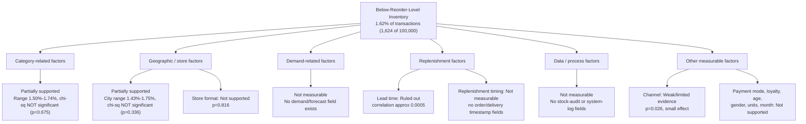

# Root Cause Analysis — Below-Reorder-Level Inventory

**Status:** Phase 9 — Root Cause Analysis
**Builds on:** Phase 7 (Performance Analysis) and Phase 8 (KPI Framework). Per Phase 7's conclusion, the margin-based hypothesis is **not pursued further** — this entire phase focuses on the one signal with real (if modest) support: inventory recorded below reorder level.

> **A methodological note before starting:** this phase adds two checks that go beyond simple grouped averages — a **chi-square significance test** and a **Pareto concentration test** — to make sure the category/city patterns from Phase 7 are real, not an artifact of looking at many groups at once. The results below are more conservative than a surface read of Phase 7's tables would suggest, and that's reported honestly rather than smoothed over.

---

## 9.1 Problem Definition

1. **What is happening?** 1,624 of 100,000 transactions (**1.62%**) in the 2024 dataset are recorded with Stock_On_Hand below the Reorder_Level threshold.
2. **Where is it happening?** Descriptively somewhat more often in Dairy/Snacks and in Mumbai/Kolkata/Chennai than in Home Care/Vegetables and Ahmedabad — though Section 9.5–9.7 below show this pattern does not clear a formal significance bar.
3. **How large is the observed issue?** Small in absolute terms. No category, city, or category-city combination exceeds **2.47%**. The overall rate is 1.62%; the highest individual cell is 2.47%.
4. **Why could this matter operationally?** Even a modest, evenly-spread 1.62% rate represents 1,624 real transactions a year where stock was below the reorder point — a non-zero volume worth a lightweight, ongoing monitoring mechanism, independent of whether any one segment is statistically "worse" than another.
5. **What evidence supports the problem?** Direct computation of Stock_On_Hand vs. Reorder_Level across all 100,000 transactions (Phase 7), corroborated by the significance and concentration testing in this phase.

**Framing:** this is a **modest, actionable inventory-monitoring signal** — not an inventory crisis, and (as shown below) less concentrated than it first appeared in Phase 7.

---

## 9.2 Evidence-Based Root Cause Analysis

| Problem | Evidence | Potential Cause | Evidence Supporting Cause | Evidence Against Cause | Confidence |
|---|---|---|---|---|---|
| Category-level variation | Range 1.50%–1.74% across 8 categories | Category-specific dynamics (e.g., Dairy's perishability driving tighter margins for error) | Dairy is numerically highest (1.74%) | Chi-square test: **p = 0.675** (not significant); range is only 0.24 points | **Low** |
| City-level variation | Range 1.43%–1.75% across 8 cities | City-specific demand density or local supply conditions | Mumbai/Kolkata numerically highest | Chi-square test: **p = 0.336** (not significant) | **Low** |
| Dairy/Mumbai & Snacks/Chennai elevated rates | 2.47% (39 cases) and 2.45% (38 cases) — highest of 64 category×city combinations | Combined category+city effect | Numerically the two highest cells tested | Chi-square across all 64 combos: **p = 0.383** (not significant); Pareto check shows no real concentration (see 9.7); each cell has ~1,500–1,650 transactions, a modest sample for a ~2% event | **Low — treat as a monitoring starting point, not a confirmed hotspot** |
| Supplier lead time as a driver | Correlation with below-reorder status ≈ **0.0005**; rate flat (1.54%–1.70%) across all lead-time bands | Longer lead time → higher shortfall risk (a common retail assumption) | None found | Near-zero correlation; no band stands out | **Ruled out in this dataset** |
| Channel as a driver | Online 1.74%, Omnichannel 1.65%, Offline 1.48% | Online/omnichannel fulfillment may draw down visible stock differently than in-store | Chi-square: **p = 0.026** (nominally significant) | Effect size still small (0.26 points); would not survive a correction for the ~9 factors tested in Section 9.4; no fulfillment/warehouse field exists to test the mechanism directly | **Weak / limited evidence** |

---

## 9.3 5 Whys Analysis

| # | Question | Answer | Type |
|---|---|---|---|
| 1 | Why are 1.62% of transactions recorded below reorder level? | Directly computed: Stock_On_Hand < Reorder_Level in 1,624 of 100,000 rows | **Data-supported** |
| 2 | Why do these specific transactions fall below reorder level rather than others? | The dataset has no demand-forecast, replenishment-order, or stock-movement field that could explain *why* a given transaction landed below threshold | **Data limitation — cannot be answered from this dataset** |
| 3 | Why do Dairy/Mumbai and Snacks/Chennai show the highest observed rates? | They are numerically highest, but a chi-square test across all 64 category×city combinations is not significant (p = 0.383), and a Pareto check (9.7) shows no real concentration. This is consistent with ordinary sampling variation across 64 groups, not a confirmed geographic/category effect | **Data-supported caveat — likely noise, not a true effect** |
| 4 | Why doesn't lead time (or most other tested factors) explain it? | Lead time correlation ≈ 0; Category, City, Store_Format, Payment_Mode, Customer_Gender, Loyalty_Flag, Units, and Month all show flat or non-significant patterns (Section 9.4) | **Data-supported** |
| 5 | Why can't the dataset explain more than "where to look"? | The dataset contains no operational-process fields — no replenishment order/delivery timestamps, no demand forecasts, no stock-count audit trail — that would be needed to identify an actual mechanism | **Data limitation — this is the honest stopping point for data-only analysis** |

**This 5 Whys terminates in a data limitation, not a root cause** — which is itself the correct, honest conclusion: recognizing when a dataset has been fully mined, and that the next step must be stakeholder validation rather than further querying, is a real BA judgment call.

---

## 9.4 Factor Analysis

| Factor | Classification | Basis |
|---|---|---|
| Category | Weak / limited evidence | Descriptive range 1.50%–1.74%; chi-square not significant (p = 0.675) |
| City | Weak / limited evidence | Descriptive range 1.43%–1.75%; chi-square not significant (p = 0.336) |
| Category × City combination | Weak / limited evidence | Highest cells identified (Dairy/Mumbai, Snacks/Chennai); combo-level chi-square not significant (p = 0.383); no Pareto concentration |
| Store Format | No evidence | Range 1.59%–1.65%; chi-square not significant (p = 0.816) |
| Channel | Weak / limited evidence | Range 1.48%–1.74%; chi-square p = 0.026, but small effect and doesn't survive correction for multiple factors tested |
| Payment Mode | No evidence | Range 1.50%–1.75%, no meaningful pattern |
| Customer Gender | No evidence | Range 1.60%–1.81% (the higher "O" figure is a small group, 5,127 rows) |
| Loyalty Flag | No evidence | 1.60% (non-loyalty) vs. 1.68% (loyalty) — negligible difference |
| Customer Age | No evidence | Flat 1.50%–1.72% across age bands; also only covers ~60% of transactions |
| Units (quantity per line) | No evidence | Flat 1.56%–1.72% across 1–5 units |
| Month / seasonality | No evidence | Ranges 1.35%–1.78% with no clear seasonal shape; November lowest, no obvious business reason evident in the data |
| **Supplier Lead Time** | **No observed relationship / ruled out as an explanatory factor in this dataset** | Correlation ≈ 0.0005; flat across all lead-time bands. *(This does not mean lead time can never cause shortages in real retail operations — only that this dataset shows no such relationship.)* |
| Demand forecasting accuracy | Not measurable with current dataset | No forecast or demand-signal field exists |
| Replenishment / reorder timing | Not measurable with current dataset | No order-placement or delivery-timestamp field exists |
| Stock-record accuracy | Not measurable with current dataset | No audit or system-log field exists |

---

## 9.5 Category Analysis

Dairy (1.74%) and Snacks (1.69%) show the highest observed below-reorder rates; Home Care (1.50%) and Vegetables (1.51%) the lowest — a range of **0.24 percentage points** across all 8 categories. A chi-square test of Category against below-reorder status returns **p = 0.675**, meaning this spread is statistically indistinguishable from random variation. A Pareto check confirms this: all 8 categories contribute a near-equal share of the 1,624 total below-reorder cases (11.6%–13.1% each — essentially the 12.5% you'd expect if the categories were identical).

**Conclusion:** the category-level differences are correctly computed but **too small and statistically weak to justify treating any single category as a distinct operational problem** on the strength of this data alone. They're more useful as a tie-breaker for where to look first than as a confirmed finding.

---

## 9.6 Geographic Analysis

**Highest-rate cities:** Mumbai and Kolkata (1.75% each), Chennai (1.74%)
**Lowest-rate cities:** Ahmedabad (1.43%), Delhi and Bengaluru (1.53% each)
**Range:** 0.32 percentage points; chi-square **p = 0.336** (not significant)

**Category-city combinations requiring attention:** Dairy/Mumbai (2.47%, 39 cases) and Snacks/Chennai (2.45%, 38 cases) are the two highest of all 64 combinations tested — but a chi-square test across all 64 cells is also not significant (p = 0.383, 63 degrees of freedom), and together these two cells account for only 2.4% and 2.3% of all below-reorder cases respectively.

**Why these two combinations are still useful for targeted monitoring, despite not being statistically confirmed:** with 64 combinations examined, some cell will show the numerically highest rate by chance alone even if no true underlying pattern exists — this is a standard "multiple comparisons" effect, not a flaw in the calculation. A business with finite monitoring capacity still has to start somewhere, and picking the descriptively highest cells is a reasonable, low-cost operational heuristic. The key discipline is to treat Dairy/Mumbai and Snacks/Chennai explicitly as **a starting hypothesis to validate**, not a confirmed hotspot to act on as if proven.

---

## 9.7 Pareto Analysis

| Cut | Concentration Result |
|---|---|
| By Category | **No concentration.** All 8 categories contribute 11.6%–13.1% of cases each — essentially even. All 8 are needed to reach 100%. |
| By City | **No concentration.** All 8 cities contribute 11.0%–13.7% of cases each — essentially even. |
| By Category×City combination (64 cells) | **No meaningful concentration.** The top 10 combinations (15.6% of all 64 cells) account for only **20.2%** of below-reorder cases — barely above the 15.6% you'd expect from pure proportionality. Reaching 80% of cases requires **47 of the 64 combinations (73.4%)** — the opposite of an 80/20 pattern. |

**Explicit conclusion, as instructed: no Pareto concentration exists in this data.** Below-reorder-level transactions are broadly and evenly scattered across categories, cities, and their combinations — this is not a "small number of bad segments" problem, it's a diffuse, low-rate pattern spread across the whole business.

---

## 9.8 Root Cause Tree

---

## 9.9 Confirmed vs. Hypothesized Causes

| Factor | Finding | Status |
|---|---|---|
| Supplier lead time | No correlation observed (r ≈ 0.0005); rate flat across all lead-time bands | **Ruled out in this dataset** |
| Category | Range 1.50%–1.74%; chi-square not significant (p = 0.675); no Pareto concentration | **Descriptive only — not statistically confirmed** |
| City | Range 1.43%–1.75%; chi-square not significant (p = 0.336) | **Descriptive only — not statistically confirmed** |
| Channel | Range 1.48%–1.74%; chi-square p = 0.026 | **Weak signal — statistically marginal, doesn't survive multi-factor correction** |
| Dairy / Mumbai | Highest single combination (2.47%, 39 of 1,624 cases) | **Operational starting point for monitoring — not a confirmed hotspot** (combo-level chi-square p = 0.383) |
| Snacks / Chennai | Second-highest combination (2.45%, 38 of 1,624 cases) | **Operational starting point for monitoring — not a confirmed hotspot** |
| Demand forecasting | No forecast/demand-signal field exists | **Not measurable — requires stakeholder validation** |
| Stock-record accuracy | No audit/system-log field exists | **Not measurable — requires stakeholder validation** |
| Replenishment process/timing | No order or delivery timestamp field exists | **Not measurable — requires stakeholder validation** |

---

## 9.10 Business Impact

- Transactions recorded below reorder level **may increase the risk of** reduced product availability if left unaddressed — though the dataset does not confirm that any transaction actually failed to fulfil as a result.
- A persistent, unmonitored pattern **may increase the risk of** lost sales opportunities or the need for emergency/rush replenishment.
- If availability gaps reach the customer level (not observable in this dataset), this **may increase the risk of** customer dissatisfaction.
- **Financial impact cannot be quantified using the available data.** No field captures cost-of-shortfall, lost-sale value, or emergency-replenishment cost.

---

## 9.11 Root Cause Conclusion

1. The dataset does **not** support the originally-assumed margin-based problem — margin % is uniform across category and brand (Phase 7).
2. Inventory availability (transactions recorded below reorder level) remains the strongest actionable signal in the dataset — but this phase's statistical testing shows it is **weaker and more diffuse** than Phase 7's tables suggested: category and city differences are not statistically significant, and no Pareto concentration exists.
3. Dairy/Mumbai and Snacks/Chennai are the two highest-observed combinations and are reasonable, low-cost **starting points** for monitoring — not confirmed hotspots.
4. Supplier lead time does not explain the observed variation in this dataset and should not be pursued as a cause.
5. The available data is sufficient to identify **where to start looking**, but not sufficient to establish **why** below-reorder occurrences happen — no demand, forecasting, replenishment-timing, or stock-accuracy fields exist to go further.
6. Confirming an actual operational root cause requires additional data (replenishment order/delivery timestamps, demand forecasts, stock-count audit results) and validation with real stakeholders — flagged here as future work, not something this dataset alone can resolve.

---

## 9.12 BA Action

- **Targeted stakeholder investigation:** validate with the simulated Inventory and Procurement Managers whether Dairy (a perishable category) and the Mumbai/Chennai markets face known operational constraints not captured in this dataset.
- **Store/category-level inventory monitoring:** because the issue is diffuse rather than concentrated, an ongoing "% below reorder level" view by category and city belongs in the KPI framework/dashboard — a one-off deep dive into two cells would be the wrong level of response to a broadly-spread pattern.
- **Reorder-alert requirements:** define a functional requirement so the future solution flags any transaction/period recorded below reorder level (feeds directly into Phase 16 Functional Requirements).
- **Exception reporting:** management should be able to view below-reorder transactions as a distinct, filterable exception list, not buried inside aggregate averages.
- **Additional data collection:** recommend the business consider capturing replenishment order/delivery timestamps and demand-forecast data if inventory availability becomes a strategic priority — this is what would be needed to move from "where" to "why."
- **Validation of inventory processes:** confirm with stakeholders whether Reorder_Level values themselves are well-calibrated (e.g., too low for fast-moving perishables like Dairy) — a policy question the data alone cannot answer.
- **KPI monitoring:** "% Transactions Below Reorder Level" (defined in Phase 8) is the standing KPI for this signal going forward, tracked by category and city, not treated as a one-time finding.

---

**Next step:** Phase 10 — As-Is Process, describing how sales/inventory data currently flows into (simulated) management decisions.
