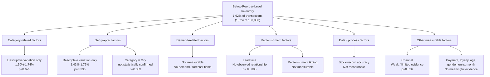

# Root Cause Analysis — Below-Reorder-Level Inventory

**Status:** Phase 9 — Root Cause Analysis
**Builds on:** Phase 7 — Business Performance Analysis and Phase 8 — KPI Framework

Per Phase 7 and Phase 8, the margin-based hypothesis is not pursued further because the available Category, Brand, and Category × Brand analysis did not provide sufficient evidence of a material high-revenue/low-margin problem.

This phase therefore focuses on the **evidence-supported inventory monitoring signal**: transaction records where `Stock_On_Hand < Reorder_Level`.

> **Methodological note:** This analysis extends the descriptive analysis from Phase 7 with chi-square significance testing and Pareto concentration analysis. These tests are used to determine whether apparent category/city differences provide sufficient evidence to be treated as meaningful patterns. Statistical results are interpreted conservatively and are not treated as proof of operational causality.

---

## 9.1 Problem Definition

### What is happening?

**1,624 of 100,000 transactions (1.62%)** in the 2024 dataset are recorded with `Stock_On_Hand` below the recorded `Reorder_Level`.

### Where is it happening?

Descriptively, below-reorder observations vary somewhat across categories and cities.

* Category range: **1.50%–1.74%**
* City range: **1.43%–1.75%**
* Highest observed Category × City combination: **Dairy × Mumbai at 2.47%**

However, subsequent statistical testing shows that these differences are **not statistically significant at the category, city, or Category × City level**.

### How large is the observed signal?

The overall rate is relatively small:

* **1.62% overall**
* **1,624 records**
* Highest Category × City rate: **2.47%**

The dataset therefore does **not** support describing this as an inventory crisis or widespread stockout problem.

### Why could this matter operationally?

A below-reorder observation can represent an inventory-monitoring exception that may warrant attention before availability becomes a larger operational issue.

However, the dataset does not establish that any below-reorder observation resulted in:

* a stockout,
* a lost sale,
* an unfulfilled customer order,
* emergency replenishment, or
* customer dissatisfaction.

Therefore, the business impact should be treated as a **potential operational risk**, not a measured outcome.

### Evidence supporting the problem

The signal is directly calculated from the relationship:

`Stock_On_Hand < Reorder_Level`

across all **100,000 transaction records**.

Phase 7 established the baseline, while this phase tests whether the observed variation provides evidence of specific contributing factors.

---

## 9.2 Evidence-Based Root Cause Analysis

| Problem / Factor          | Evidence                                           | Potential Explanation                                                | Evidence Supporting Explanation                                | Evidence Against / Limitation                                                  | Confidence                        |
| ------------------------- | -------------------------------------------------- | -------------------------------------------------------------------- | -------------------------------------------------------------- | ------------------------------------------------------------------------------ | --------------------------------- |
| Category variation        | Below-reorder rate ranges from 1.50%–1.74%         | Category-specific demand or replenishment characteristics            | Dairy and Snacks have the highest observed rates               | Chi-square p = **0.675**; difference is only 0.24 percentage points            | **Low**                           |
| City variation            | Below-reorder rate ranges from 1.43%–1.75%         | Local demand or supply conditions                                    | Mumbai and Kolkata have the highest observed rates             | Chi-square p = **0.336**; difference is only 0.32 percentage points            | **Low**                           |
| Category × City variation | Dairy × Mumbai = 2.47%; Snacks × Chennai = 2.45%   | Interaction between category and location                            | These are the two highest observed cells                       | Chi-square p = **0.383**; no meaningful Pareto concentration                   | **Low**                           |
| Supplier lead time        | Correlation with below-reorder status ≈ **0.0005** | Longer lead time could potentially increase replenishment exposure   | No meaningful evidence found                                   | Relationship is effectively zero in this dataset                               | **Not supported in this dataset** |
| Channel                   | Online 1.74%, Omnichannel 1.65%, Offline 1.48%     | Channel-specific fulfillment or stock-consumption differences        | Chi-square p = **0.026** before multiple-comparison adjustment | Effect is small; no operational fulfillment fields exist to test the mechanism | **Weak / limited**                |
| Demand forecasting        | No forecast or demand-signal field                 | Forecast accuracy could influence replenishment timing               | Cannot be tested                                               | Required data is unavailable                                                   | **Not measurable**                |
| Replenishment timing      | No order-placement or delivery timestamps          | Delayed replenishment could contribute to below-reorder observations | Cannot be tested                                               | Required operational history is unavailable                                    | **Not measurable**                |
| Stock-record accuracy     | No inventory audit/system-log information          | Recorded stock could differ from physical stock                      | Cannot be tested                                               | No audit trail is available                                                    | **Not measurable**                |

> **Interpretation rule:** A factor is not treated as a confirmed root cause unless the available evidence supports that conclusion. Domain knowledge can generate hypotheses for stakeholder validation, but it is not treated as dataset evidence.

---

## 9.3 5 Whys Analysis

| # | Question                                                                | Answer                                                                                                                                                                                                      | Classification                              |
| - | ----------------------------------------------------------------------- | ----------------------------------------------------------------------------------------------------------------------------------------------------------------------------------------------------------- | ------------------------------------------- |
| 1 | Why are 1.62% of transaction records below reorder level?               | `Stock_On_Hand < Reorder_Level` occurs in 1,624 of 100,000 records.                                                                                                                                         | **Data-supported**                          |
| 2 | Why do these records fall below the reorder level?                      | The dataset does not contain demand forecasts, replenishment orders, stock movements, or related operational events that explain why an individual record is below threshold.                               | **Data limitation**                         |
| 3 | Why do Dairy/Mumbai and Snacks/Chennai have the highest observed rates? | They are numerically the highest observed combinations, but the Category × City test is not statistically significant (p = 0.383). Therefore, the data does not establish a genuine Category × City effect. | **Descriptive observation — not confirmed** |
| 4 | Why does supplier lead time not explain the observed variation?         | The correlation with below-reorder status is approximately 0.0005, and the rate remains broadly flat across lead-time bands.                                                                                | **Data-supported**                          |
| 5 | Why can't the dataset identify the operational mechanism?               | It lacks the process and historical fields required to trace demand, replenishment decisions, stock movements, delivery timing, and inventory-record accuracy.                                              | **Data limitation**                         |

### 5 Whys Conclusion

The 5 Whys does **not produce a confirmed operational root cause**.

Instead, it establishes an important BA boundary:

> The available data can identify **where below-reorder observations occur**, but cannot reliably establish **why they occur**.

Further investigation therefore requires stakeholder/process validation and additional operational data rather than additional querying of the same transaction dataset.

---

## 9.4 Factor Analysis

| Factor                      | Classification           | Evidence                                                                                |
| --------------------------- | ------------------------ | --------------------------------------------------------------------------------------- |
| Category                    | Descriptive only         | Range 1.50%–1.74%; chi-square p = 0.675                                                 |
| City                        | Descriptive only         | Range 1.43%–1.75%; chi-square p = 0.336                                                 |
| Category × City             | Descriptive only         | Highest cells identified, but chi-square p = 0.383 and no Pareto concentration          |
| Store Format                | No meaningful evidence   | Range 1.59%–1.65%; chi-square p = 0.816                                                 |
| Channel                     | Weak / limited evidence  | Range 1.48%–1.74%; p = 0.026 before adjustment, with small effect                       |
| Payment Mode                | No meaningful evidence   | Range 1.50%–1.75%; no meaningful pattern                                                |
| Customer Gender             | No meaningful evidence   | Range 1.60%–1.81%; higher values should also be interpreted with group-size limitations |
| Loyalty Flag                | No meaningful evidence   | 1.60% non-loyalty vs. 1.68% loyalty                                                     |
| Customer Age                | No meaningful evidence   | Range 1.50%–1.72%; age is missing for approximately 40% of records                      |
| Units                       | No meaningful evidence   | Range 1.56%–1.72% across 1–5 units                                                      |
| Month                       | No meaningful evidence   | Range 1.35%–1.78%; no clear seasonal pattern                                            |
| Supplier Lead Time          | No observed relationship | Correlation ≈ 0.0005; rate broadly flat across lead-time bands                          |
| Demand Forecasting Accuracy | Not measurable           | No forecast or demand-signal field                                                      |
| Replenishment Timing        | Not measurable           | No order-placement or delivery timestamps                                               |
| Stock-Record Accuracy       | Not measurable           | No inventory audit or system-log fields                                                 |

### Interpretation

The available transaction data does not provide strong evidence that any tested factor is a reliable explanatory driver of the below-reorder observations.

The **Channel** result is the only factor with a conventional p-value below 0.05, but the effect is small and the available dataset does not contain the operational fulfillment information needed to establish a mechanism. It should therefore remain a **weak hypothesis**, not a confirmed root cause.

---

## 9.5 Category Analysis

Dairy (**1.74%**) and Snacks (**1.69%**) have the highest observed below-reorder rates, while Home Care (**1.50%**) and Vegetables (**1.51%**) have the lowest.

The total category range is only **0.24 percentage points**.

A chi-square test of Category against below-reorder status returns **p = 0.675**, providing no statistically significant evidence of a category-level relationship in this dataset.

A Pareto review also shows that below-reorder cases are distributed relatively evenly across all eight categories, with each contributing approximately **11.6%–13.1%** of cases.

### Conclusion

Category differences are valid descriptive observations, but they are **not strong enough to establish a category-specific operational root cause**.

They may be used as a starting point for stakeholder questions or monitoring, but should not independently drive a category-specific intervention.

---

## 9.6 Geographic Analysis

### Highest observed rates

* Mumbai: **1.75%**
* Kolkata: **1.75%**
* Chennai: **1.74%**

### Lowest observed rates

* Ahmedabad: **1.43%**
* Delhi: **1.53%**
* Bengaluru: **1.53%**

The overall city range is **0.32 percentage points**.

A chi-square test gives **p = 0.336**, so the observed city differences are not statistically significant.

### Category × City

The two highest observed combinations are:

* **Dairy × Mumbai:** 2.47% — 39 cases
* **Snacks × Chennai:** 2.45% — 38 cases

However, the Category × City analysis gives **p = 0.383**, and the Pareto analysis shows no meaningful concentration.

These combinations should therefore be treated as **monitoring starting points or stakeholder-validation hypotheses**, not confirmed hotspots.

---

## 9.7 Pareto Analysis

| Analysis Cut    | Result                                                                                                                                                                                |
| --------------- | ------------------------------------------------------------------------------------------------------------------------------------------------------------------------------------- |
| By Category     | **No meaningful concentration.** All 8 categories contribute approximately 11.6%–13.1% of cases.                                                                                      |
| By City         | **No meaningful concentration.** All 8 cities contribute approximately 11.0%–13.7% of cases.                                                                                          |
| Category × City | **No meaningful concentration.** The top 10 combinations account for approximately 20.2% of below-reorder cases, while 47 of 64 combinations are required to reach approximately 80%. |

### Conclusion

The below-reorder observations are **diffuse rather than concentrated**.

This is important for solution design: the evidence does not support building a response around a small number of supposedly problematic categories or cities.

A broader **exception-monitoring and visibility capability** is more consistent with the evidence than a narrowly targeted intervention.

---

## 9.8 Root Cause Tree

---

## 9.9 Confirmed vs. Hypothesized Causes

| Factor                         | Finding                                                              | Status                                                        |
| ------------------------------ | -------------------------------------------------------------------- | ------------------------------------------------------------- |
| Supplier Lead Time             | Correlation ≈ 0.0005; no meaningful variation across lead-time bands | **No observed relationship in this dataset**                  |
| Category                       | Range 1.50%–1.74%; p = 0.675                                         | **Descriptive only**                                          |
| City                           | Range 1.43%–1.75%; p = 0.336                                         | **Descriptive only**                                          |
| Category × City                | Highest cells are Dairy/Mumbai and Snacks/Chennai; p = 0.383         | **Descriptive only**                                          |
| Channel                        | p = 0.026, but small observed effect and limited operational data    | **Weak / limited evidence**                                   |
| Dairy / Mumbai                 | Highest observed combination: 2.47%                                  | **Monitoring / validation hypothesis, not confirmed hotspot** |
| Snacks / Chennai               | Second-highest observed combination: 2.45%                           | **Monitoring / validation hypothesis, not confirmed hotspot** |
| Demand Forecasting             | Required data unavailable                                            | **Not measurable**                                            |
| Stock-record Accuracy          | Audit/system-log data unavailable                                    | **Not measurable**                                            |
| Replenishment Process / Timing | Order and delivery history unavailable                               | **Not measurable**                                            |

---

## 9.10 Business Impact

The available data does not quantify an actual financial or customer impact.

However, below-reorder observations **may indicate situations requiring inventory attention** if the recorded threshold represents a meaningful operational replenishment trigger.

Potential implications include:

* increased risk of reduced product availability;
* increased need for timely replenishment monitoring;
* possible future lost-sales exposure if inventory becomes insufficient to meet demand;
* possible operational effort associated with urgent replenishment.

These remain **potential impacts**, because the dataset contains no direct fields for lost sales, customer fulfillment failure, emergency replenishment cost, or customer dissatisfaction.

### Quantifiable impact limitation

Financial impact cannot currently be calculated because the dataset does not contain:

* lost-sale value;
* stockout duration;
* emergency replenishment cost;
* customer order fulfillment status; or
* inventory shortage cost.

---

## 9.11 Root Cause Conclusion

1. The original margin-based hypothesis is **not supported strongly enough by the available data** and is not carried forward.

2. The dataset confirms a **1.62% transaction-level below-reorder observation rate**, making inventory visibility a reasonable area for further BA investigation.

3. Category and city differences are **descriptive rather than statistically confirmed**.

4. Dairy/Mumbai and Snacks/Chennai are the highest observed Category × City combinations, but they should be treated as **starting points for validation**, not proven operational hotspots.

5. Pareto analysis shows that below-reorder observations are **diffuse across the business**, rather than concentrated in a small number of segments.

6. Supplier lead time shows **no observed relationship** with below-reorder status in this dataset and should not be treated as a root cause.

7. Channel shows a weak statistical signal, but the effect is small and the dataset lacks operational fulfillment fields required to explain the mechanism.

8. The available dataset can identify **where below-reorder observations occur**, but cannot establish **why they occur**.

9. Confirming an operational root cause requires additional data and stakeholder validation, including replenishment history, demand/forecast information, inventory movements, delivery timing, and stock-record accuracy information.

---

## 9.12 BA Action

Based on the evidence, the recommended BA response is **visibility and validation rather than an unsupported operational intervention**.

### 1. Introduce exception monitoring

The future reporting solution should provide visibility into transaction-level below-reorder observations using the KPI defined in Phase 8:

**% Transactions Below Reorder Level**

The measure should be filterable by available dimensions such as:

* Category
* City
* Channel
* Store Format
* Month

### 2. Provide exception visibility

Management should be able to identify the underlying records contributing to the KPI rather than relying only on an aggregate percentage.

This supports investigation of individual exceptions while preserving the distinction between an observed data condition and a confirmed operational problem.

### 3. Validate the process

Stakeholder/process validation should investigate:

* how reorder levels are established;
* how frequently inventory is reviewed;
* how replenishment decisions are triggered;
* how purchase orders are created;
* how deliveries are recorded; and
* how inventory records are reconciled with physical stock.

These are **validation questions**, not assumptions about how RetailCo currently operates.

### 4. Investigate additional data requirements

If inventory availability is confirmed as a strategic business concern, future data requirements should include:

* persistent Product/SKU identity;
* persistent Store identity;
* inventory movement history;
* replenishment order timestamps;
* delivery timestamps;
* demand/forecast information;
* stock-count/audit history.

### 5. Use observed hotspots cautiously

Dairy/Mumbai and Snacks/Chennai can be included as examples in stakeholder validation or monitoring scenarios because they have the highest observed rates.

They should **not** be treated as confirmed problem areas unless operational evidence supports the hypothesis.

### 6. Maintain KPI consistency

`% Transactions Below Reorder Level` remains the standing inventory KPI established in Phase 8.

Its interpretation must remain:

> **A transaction-level inventory attention signal, not a stockout or shortage rate.**

---

## BA Decision

The root-cause analysis reaches an intentional stopping point.

The correct BA conclusion is **not** to manufacture a root cause from weak statistical patterns. Instead, the evidence supports a more defensible decision:

**Build visibility → monitor exceptions → validate the operational process → collect the missing data → investigate root causes when evidence becomes available.**

This provides a direct bridge from the analytical findings into the next BA artifacts:

**Evidence → Root Cause Boundary → Business Need → Process Model → Requirements**

---

**Next step:** Phase 10 — As-Is Process Model, documenting the simulated current-state flow for how sales and inventory information moves into management monitoring and replenishment decisions.
