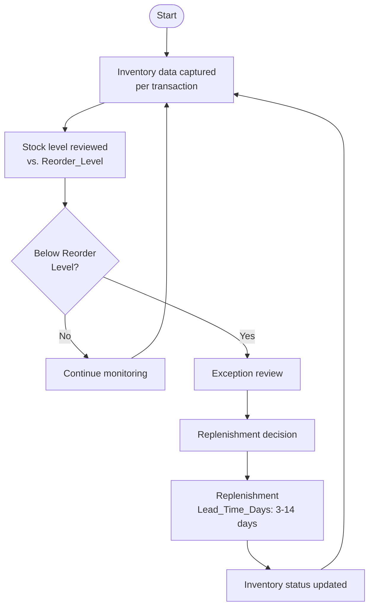
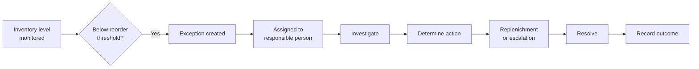

# As-Is Process Analysis — Inventory Monitoring & Replenishment

**Status:** Phase 10 — As-Is Process Analysis
**Builds on:** Phases 6–9. Per Phase 9's conclusion, this phase focuses on **inventory exception monitoring and visibility** — not a margin problem or a statistically-confirmed geographic/category root cause, since none exists at a defensible level.

> **Critical framing for this entire phase:** the dataset contains transaction, sales, and inventory-snapshot data — it does **not** contain employee interviews, SOPs, workflow logs, or direct observation of how RetailCo actually operates. Every element below is one of three things, labeled explicitly throughout:
> - **Evidence from dataset** — directly computed or structurally confirmed
> - **Assumption** — a realistic BA construction based on standard FMCG retail practice, not confirmed by this data
> - **Requires stakeholder validation** — a specific unknown that only a real conversation with RetailCo staff could resolve
>
> No actual RetailCo procedure is claimed anywhere in this document.

---

## 10.1 As-Is Process Overview

| Step | Actor/System | Activity | Input | Output | Possible Issue | Evidence/Assumption |
|---|---|---|---|---|---|---|
| 1. Inventory data captured | Store/POS system *(assumed)* | Each sale records Stock_On_Hand and Reorder_Level alongside the transaction | Sale event | Stock_On_Hand, Reorder_Level values on record | The snapshot is transaction-triggered, not continuous — gaps between sales are invisible | **Evidence from dataset**: these fields exist and populate on every transaction (Phase 1). **Assumption**: the underlying capture mechanism (POS, manual entry, etc.) |
| 2. Inventory status reviewed | Inventory Manager *(assumed)* | Periodic review of stock levels against reorder thresholds | Stock_On_Hand, Reorder_Level | A view of current stock position | Review cadence unknown | **Assumption** — no field records who reviewed what, or when |
| 3. Below-reorder items identified | Inventory Manager or system *(assumed)* | Comparing Stock_On_Hand to Reorder_Level | Reviewed stock data | Flagged below-reorder transactions | Unclear whether this comparison happens today at all, automated or manual | **Assumption** — this project performs the comparison (1.62% rate, Phase 7); whether RetailCo does so operationally is unknown |
| 4. Exception investigated | Inventory Manager / Procurement *(assumed)* | Looking into why a specific item is below threshold | Flagged exception | A next-step decision | No exception/case/ticket field exists anywhere in the data | **Requires stakeholder validation** |
| 5. Replenishment decision made | Procurement Manager *(assumed)* | Decide whether/how much to reorder | Investigated exception | A reorder decision | No purchase-order or decision field exists | **Requires stakeholder validation** |
| 6. Stock replenished | Supplier → Store *(assumed)* | Physical restocking | Reorder decision | Updated physical stock | Lead_Time_Days exists (3–14 days) but no field confirms an actual delivery event took place | **Evidence from dataset**: Lead_Time_Days field exists (Phase 1). **Assumption**: that it reflects a completed real delivery |
| 7. Inventory status updated | Store/POS system *(assumed)* | Stock_On_Hand presumably resets after replenishment | Physical restock | Updated Stock_On_Hand for future transactions | No before/after snapshot exists to confirm this update happens as assumed | **Assumption** |

---

## 10.2 Process Actors

These actors were **not directly observed or interviewed** — they're included because these roles are standard in FMCG retail inventory operations and align with the Stakeholder Register (Phase 4):

- **Store/Branch Staff** — closest to the physical stock and point of sale
- **Inventory Manager** — owns stock-level monitoring (Phase 4 stakeholder)
- **Procurement/Replenishment Team** — places and manages reorders (Phase 4 stakeholder)
- **Supplier** — external party fulfilling replenishment within Lead_Time_Days
- **Operations Manager** — oversees store-format/channel operations (Phase 4 stakeholder)
- **Sales/Channel Team** — channel-specific fulfillment; relevant given the modest Online-vs-Offline difference found in Phase 9
- **IT/Data System** — captures and stores transaction and inventory-snapshot data (not a person)

---

## 10.3 As-Is Process Flow

**Assumed current-state process based on available data; requires stakeholder validation.**

This can be recreated directly in draw.io, Lucidchart, or Visio using the same shapes: rounded rectangle (Start), rectangles (activities), and one diamond (the Below-Reorder-Level decision point) with two outgoing paths.

---

## 10.4 Process Pain Points

| Potential Pain Point | Why It Could Matter | Dataset Evidence | Confidence | Validation Needed |
|---|---|---|---|---|
| Lack of continuous inventory visibility | Stock is only visible at the moment of a transaction; gaps between sales are blind spots | No separate periodic/continuous inventory feed exists — only transaction-linked snapshots | Medium | Confirm whether a separate inventory system exists outside this transactional data |
| Delayed identification of below-reorder items | If review is periodic/manual, an exception could sit unnoticed | No review-timestamp field exists | Low (plausible, not proven) | Yes |
| Manual monitoring | No automated flag/alert field exists in the data | Absence of any alert/flag field | Medium | Confirm whether a BI/alerting tool already exists |
| Lack of exception alerts | Same underlying absence as above | Same as above | Medium | Yes |
| Inconsistent follow-up | No case-management or resolution field to show whether flagged items get followed up | Absence of exception-ID, resolution-date, or outcome field | Low–Medium | Yes |
| Lack of centralized reporting | Cannot confirm from data whether one dashboard exists or reporting is fragmented | No evidence either way (consistent with the Phase 2 assumption, not proven here) | Low (assumption) | Yes |
| Difficulty identifying recurring exceptions | Without a persistent Product/SKU or Store ID, the same item/location can't be tracked over time | **Structurally confirmed** in Phase 1/6 (DQ-004): no persistent product/store identity exists | Medium–High (this one is data-structural, not pure guesswork) | Confirm whether a real Product/Store master exists elsewhere in RetailCo's systems |
| Lack of historical exception tracking | No trend field beyond the transaction date | No dedicated exception-log exists | Medium | Yes |
| Lack of clear ownership | Cannot tell who is accountable when an exception occurs | No "owner"/"assigned to" field exists | Low (assumption) | Yes |

---

## 10.5 Process Gap Analysis

| Area | Current/Assumed State | Desired State | Gap | Business Impact |
|---|---|---|---|---|
| Monitoring | Periodic/manual review (assumed) | Continuous, automated comparison of Stock_On_Hand vs. Reorder_Level | No automation confirmed | May increase risk of prolonged, unnoticed exceptions |
| Exception detection | Ad hoc identification (assumed) | Systematic, rule-based flagging of every below-reorder transaction | No flagging mechanism evidenced | May increase risk of missed exceptions |
| Alerts | None / manual (assumed) | Automated alert to the responsible owner on threshold breach | No alert evidence | Plausibly slower response time |
| Reporting | Fragmented/ad hoc (Phase 2 assumption) | Centralized dashboard showing exceptions by category/city (Phase 8 KPI) | No centralized reporting evidenced | Management lacks one source of truth |
| Ownership | Unclear/undefined (assumed) | A named owner accountable per the RACI in 10.7 | No ownership field | Risk of exceptions falling through the cracks |
| Investigation | Inconsistent/undocumented (assumed) | Standard investigation workflow with recorded outcome | No investigation-outcome field | Cannot confirm whether causes are ever identified operationally |
| Escalation | Undefined (assumed) | Clear escalation path for high-priority/recurring exceptions | No escalation field | Risk of high-priority items not getting timely attention |
| Historical tracking | Not possible with current data structure | Trackable history per product/location over time | **Confirmed structural gap** (Phase 6, DQ-004) | Cannot distinguish a one-off exception from a recurring one |
| KPI visibility | Not confirmed as monitored today | "% Transactions Below Reorder Level" tracked as a standing KPI (Phase 8) | KPI defined here, not confirmed as already in use | Directly addresses the Phase 2 business need |

---

## 10.6 Inventory Exception Workflow (Proposed Process Improvement)

**This is a proposed improvement, not a confirmed existing workflow.**

The key difference from the AS-IS flow (10.3): every exception gets an explicit **owner, investigation step, and recorded outcome** — none of which the current data shows exists today.

---

## 10.7 RACI — Proposed Inventory Exception Process

**Proposed responsibility model, requiring stakeholder validation.** R = Responsible, A = Accountable, C = Consulted, I = Informed

| Activity | Store/Operations | Inventory Manager | Procurement | Supplier | IT/Data |
|---|---|---|---|---|---|
| Monitor stock levels | R | A | I | I | R |
| Identify below-reorder exception | I | A | I | I | R |
| Investigate exception | C | A/R | C | I | I |
| Decide replenishment action | I | C | A/R | I | I |
| Fulfill replenishment (physical restock) | R | I | C | A/R | I |
| Update inventory status in system | R | I | I | I | A/R |
| Record & report exception outcome | I | R | C | I | A |

---

## 10.8 As-Is Process KPIs

| KPI | Definition | Formula | Why It Matters | Available in Dataset? |
|---|---|---|---|---|
| Below-Reorder-Level Rate | Share of transactions recorded with stock under reorder threshold | COUNT(Stock_On_Hand<Reorder_Level) ÷ COUNT(*) | The core signal established in Phases 7–9 | **Yes** — 1.62% overall |
| Inventory Availability Rate | Inverse framing of the above | 1 − Below-Reorder-Level Rate | Positive-framing alternative for dashboards | **Yes** — 98.38% overall |
| Inventory Exception Rate | Same underlying concept, formalized as an operational "exception" | Same formula, once an exception threshold is agreed with stakeholders | Would formalize the monitoring metric operationally | **Yes**, pending an agreed definition |
| Exception Resolution Time | Time between exception detected and resolved | Resolution timestamp − Detection timestamp | Measures process responsiveness | **No** — no detection or resolution timestamp exists |
| Replenishment Response Time | Time between replenishment decision and stock arrival | Delivery timestamp − Decision timestamp | Measures supply-side responsiveness | **No** — only the static Lead_Time_Days field exists, not an observed actual duration |
| Stockout Rate | Share of transactions/time with zero stock | COUNT(Stock_On_Hand=0) ÷ COUNT(*) | Would measure true unavailability | **No** — Stock_On_Hand never reaches 0 in this dataset |
| Exception Recurrence Rate | Share of exceptions that recur for the same product/location | Requires tracking one product/store over time | Would show whether exceptions are one-off or systemic | **No** — no persistent Product/SKU or Store ID exists (Phase 6, DQ-004) |

---

## 10.9 Data Gaps

| Missing Data | Why Needed | How It Would Help RCA/Process Analysis |
|---|---|---|
| Reorder/purchase order history | Confirms whether/when a reorder was actually placed after an exception | Validates whether Step 5 of the AS-IS process (10.1) happens as assumed |
| True stockout records (if any occur operationally) | This dataset shows Stock_On_Hand never hits 0 — unclear if that's real or an artifact of how data was captured | Would confirm whether "below reorder" ever escalates to a real stockout |
| Replenishment/delivery timestamps | Distinguishes planned lead time from actual delivery performance | Would test whether real supplier delays (vs. the static Lead_Time_Days field, already ruled out in Phase 9) relate to exceptions |
| Actual demand/sales-forecast data | Compare forecasted vs. actual demand | Would test the "demand spike" hypothesis left as Not Measurable in Phase 9 |
| Persistent Product/SKU and Store IDs | Track the same item/location over time | Enables real Exception Recurrence Rate and true per-SKU inventory tracking |
| Inventory adjustment/write-off records | Reconcile recorded stock against physical counts | Validates whether Stock_On_Hand reflects true physical inventory |
| Exception timestamps and case records | Capture when an exception was flagged and by whom | Enables Exception Resolution Time and ownership analysis |
| Store-level SOPs/operational procedures | Replace the assumed AS-IS process (10.1) with a validated one | Directly resolves the "Assumption" labels throughout this phase |
| Employee/user action logs | See who reviewed, flagged, or acted on inventory data | Resolves the "Lack of clear ownership" pain point (10.4) |
| Supplier fulfillment records | Confirm whether suppliers deliver within the stated Lead_Time_Days | Tests supply-side reliability independent of the already-ruled-out static correlation |
| Approval/escalation records | Understand if/how exceptions are escalated | Validates the RACI (10.7) and the escalation gap (10.5) |

---

## 10.10 BA Validation Questions

Questions a real BA would take to RetailCo's (simulated) stakeholders to validate everything assumed above:

1. How is inventory currently monitored — continuously, daily, weekly, or ad hoc?
2. Who is responsible for identifying when stock falls below the reorder level?
3. Is the comparison between stock on hand and reorder level automated today, or manual?
4. When an item is flagged below reorder level, what happens next, step by step?
5. Who makes the final call on replenishment timing and quantity?
6. Are below-reorder exceptions logged anywhere — a system, spreadsheet, or ticket — and if so, where?
7. On average, how long does it take from identifying an exception to the stock being replenished?
8. Does the current process distinguish a one-off exception from a recurring one at the same product or store?
9. What reports or dashboards do the Inventory and Procurement Managers use today, if any?
10. Does Dairy in Mumbai or Snacks in Chennai have any known operational differences — shelf life, storage capacity, local demand patterns — that might explain their slightly higher observed rates?
11. Is the inventory process handled differently across Online, Offline, and Omnichannel, given the modest channel difference observed in Phase 9?
12. Are reorder-level thresholds set centrally, or do they vary by store/category based on local judgment?
13. What typically causes delays in replenishment once a decision has been made?
14. How are discrepancies between recorded and physical stock identified and corrected today?
15. What would the Inventory Manager most want to see in a real-time inventory exception view?

---

## 10.11 Final As-Is Conclusion

The dataset identifies *where* inventory exceptions occur (1.62% of transactions, modestly higher in Dairy/Snacks and a few cities) but reveals nothing about RetailCo's actual operational workflow — so the process described in this phase is an **assumption-based process model**, built on standard FMCG retail practice and labeled as such throughout, not a documented reality.

The main potential process opportunity is improving **inventory exception visibility, monitoring, ownership, and follow-up** — not chasing a confirmed geographic/category root cause, since Phase 9 showed none exists at a statistically defensible level. The exact operational root cause remains unconfirmed: this phase converts "what we don't know" into a concrete list of validation questions (10.10) and data gaps (10.9) rather than guessing further. Stakeholder interviews and additional operational data — reorder history, timestamps, persistent product/store IDs — are required before this AS-IS process can be treated as accurate.

These findings — the assumed process, its pain points, and the gaps identified — form the foundation for the **TO-BE process and requirements in the phases that follow.**

---

**Next step:** Phase 11 — Pain Point Analysis (consolidated, prioritized), followed by Phase 12 — Gap Analysis and Phase 13 — To-Be Process.
