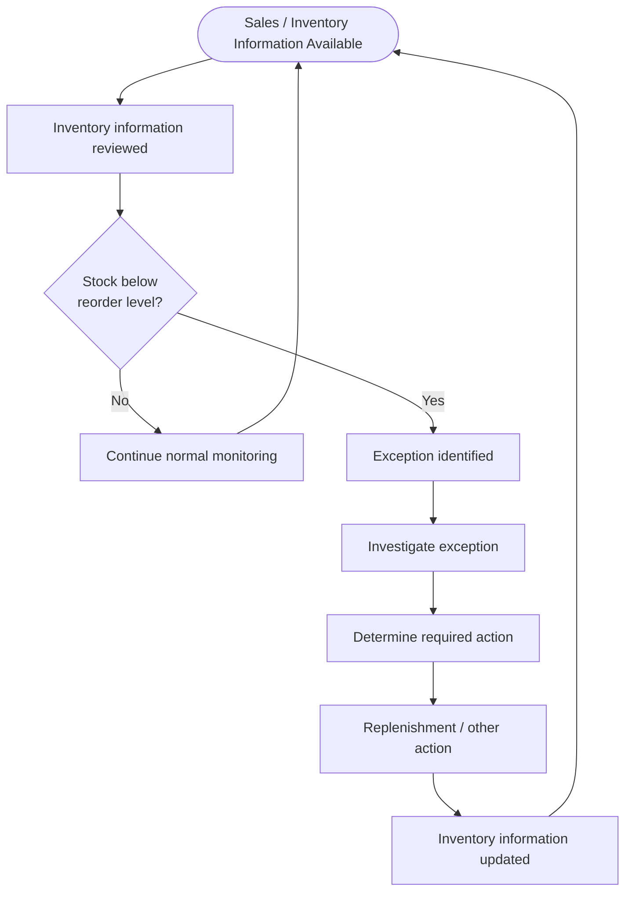

# As-Is Process Analysis — Inventory Monitoring & Replenishment

**Status:** Phase 10 — As-Is Process Analysis
**Builds on:** Phases 6–9

Per the Root Cause Analysis, this phase focuses on the **inventory exception-monitoring opportunity** identified in the available data. It does not assume a confirmed category, geographic, supplier, or operational root cause.

> **Critical framing:** The available dataset contains transaction, sales, and inventory-related fields, but it does not contain employee interviews, SOPs, workflow logs, system audit trails, or direct observation of RetailCo's operations.
>
> Therefore, this document distinguishes between:
>
> * **Evidence from dataset** — directly observed or structurally confirmed from the available data
> * **Assumption** — a reasonable process hypothesis used to construct the case study
> * **Requires stakeholder validation** — something that cannot be established from the available data
>
> **No actual RetailCo operating procedure is claimed as fact.**

---

## 10.1 As-Is Process Scope

The process being examined is the assumed current-state flow from **inventory information becoming available → inventory status being reviewed → potential below-reorder exception → replenishment-related action**.

The purpose of the As-Is model is not to claim that this is RetailCo's actual workflow. It is to make the current knowledge, assumptions, and process gaps explicit so they can be validated before designing the To-Be process.

---

## 10.2 As-Is Process Overview

| Step                                  | Actor / System                          | Activity                                                                             | Input                      | Output                                                            | Known Gap / Question                                                                                                         | Classification                       |
| ------------------------------------- | --------------------------------------- | ------------------------------------------------------------------------------------ | -------------------------- | ----------------------------------------------------------------- | ---------------------------------------------------------------------------------------------------------------------------- | ------------------------------------ |
| 1. Sales transaction recorded         | Store / transaction system *(assumed)*  | A transaction is recorded together with available sales and inventory-related fields | Sale information           | Transaction record containing `Stock_On_Hand` and `Reorder_Level` | Dataset provides transaction-linked inventory values but does not show whether a separate continuous inventory system exists | **Evidence + assumption**            |
| 2. Inventory status becomes available | Inventory / data system *(assumed)*     | Inventory-related information is made available for review                           | Transaction/inventory data | Available stock information                                       | Frequency and source of inventory updates are unknown                                                                        | **Assumption / validation required** |
| 3. Stock compared with reorder level  | Inventory Manager or system *(assumed)* | `Stock_On_Hand` is compared with `Reorder_Level`                                     | Stock and reorder values   | Potential below-reorder condition                                 | Dataset does not show whether this comparison occurs operationally today                                                     | **Analysis evidence + assumption**   |
| 4. Exception identified               | Inventory / operations role *(assumed)* | A below-reorder condition is identified for investigation                            | Below-reorder condition    | Potential inventory exception                                     | No exception flag, case ID, or alert history exists in the dataset                                                           | **Requires validation**              |
| 5. Exception investigated             | Inventory / Procurement *(assumed)*     | Possible reason and required action are assessed                                     | Exception information      | Investigation outcome / action decision                           | No investigation records or resolution history are available                                                                 | **Requires validation**              |
| 6. Replenishment decision             | Procurement / Inventory *(assumed)*     | A decision is made about whether and how to replenish                                | Investigation outcome      | Replenishment decision                                            | No purchase-order or decision records exist                                                                                  | **Requires validation**              |
| 7. Replenishment occurs               | Supplier / Store *(assumed)*            | Ordered stock is delivered and received                                              | Replenishment decision     | Physical stock received                                           | `Lead_Time_Days` exists, but the dataset does not confirm actual order-to-delivery events                                    | **Assumption / validation required** |
| 8. Inventory information is updated   | Store / inventory system *(assumed)*    | Inventory information is updated after stock movement                                | Physical stock movement    | Updated inventory record                                          | No before/after inventory history is available                                                                               | **Requires validation**              |

### Important boundary

The dataset allows the analysis to calculate:

`Stock_On_Hand < Reorder_Level`

It does **not** allow the project to confirm that the above process is actually performed in this sequence by RetailCo.

---

## 10.3 As-Is Process Flow

**Assumption-based current-state model — requires stakeholder validation.**

### Interpretation

The flow above represents a **process hypothesis** rather than a documented RetailCo procedure.

The data confirms the existence of the relevant inventory fields and allows the below-reorder condition to be calculated. It does not confirm:

* who performs the review;
* how frequently the review occurs;
* whether alerts are automated;
* how exceptions are investigated;
* who approves replenishment;
* how replenishment is recorded; or
* how inventory records are reconciled.

Those questions are carried into stakeholder validation.

---

## 10.4 Process Actors

The following roles are included based on the simulated stakeholder model and standard process assumptions. They were **not interviewed or directly observed**.

| Actor                            | Potential Process Role                                             | Status                |
| -------------------------------- | ------------------------------------------------------------------ | --------------------- |
| Store / Branch Staff             | Observe physical stock, support sales and replenishment activities | Simulated             |
| Inventory Manager                | Monitor inventory conditions and investigate exceptions            | Simulated             |
| Procurement / Replenishment Team | Manage replenishment decisions and supplier orders                 | Simulated             |
| Supplier                         | Fulfill replenishment requests                                     | Simulated             |
| Operations Manager               | Oversee operational performance and escalation                     | Simulated             |
| IT / Data System                 | Capture, store, and provide transaction/inventory information      | Simulated system role |

### Actor Boundary

These roles should **not** be presented as actual RetailCo employees or confirmed process owners.

Actual ownership must be validated with stakeholders in a real engagement.

---

## 10.5 As-Is Process Pain Points

The following are **potential process pain points**, not confirmed statements about RetailCo's current operation.

| Potential Pain Point                                  | Why It Could Matter                                                             | Available Evidence                                         | Confidence  | Validation Required                                           |
| ----------------------------------------------------- | ------------------------------------------------------------------------------- | ---------------------------------------------------------- | ----------- | ------------------------------------------------------------- |
| Limited visibility between transaction observations   | Transaction-linked inventory values do not provide continuous inventory history | No persistent inventory movement history exists in dataset | Medium      | Confirm whether a separate continuous inventory system exists |
| Below-reorder conditions may not be centrally visible | The dataset contains no exception/alert history                                 | No exception flag or alert field                           | Low–Medium  | Confirm whether alerts exist outside the dataset              |
| Exception follow-up cannot be demonstrated            | No investigation or resolution records exist                                    | No case ID, resolution timestamp, or outcome field         | Medium      | Confirm current exception-management process                  |
| Ownership cannot be established from data             | No owner/assignment information exists                                          | No ownership fields                                        | Low         | Validate actual accountability                                |
| Recurring exceptions cannot be reliably tracked       | No persistent Product/SKU or Store identity                                     | DQ-004 structural limitation                               | Medium–High | Confirm whether master data exists in other systems           |
| Historical inventory movement cannot be reconstructed | Static transaction-level values do not provide inventory history                | No inventory ledger / movement history                     | High        | Determine availability of inventory history                   |
| Current reporting approach is unknown                 | Dataset does not show whether management dashboards/reports exist               | No reporting-process metadata                              | Low         | Confirm current reporting tools and cadence                   |

> **Important:** The absence of a field in this dataset does not prove that the corresponding business capability does not exist elsewhere. It only proves that it cannot be established from the supplied dataset.

---

## 10.6 As-Is Process Gap Analysis

| Process Area           | Current Knowledge / Assumed State                                           | Desired Capability                                        | Gap Identified                                                | Evidence Status               |
| ---------------------- | --------------------------------------------------------------------------- | --------------------------------------------------------- | ------------------------------------------------------------- | ----------------------------- |
| Inventory visibility   | Transaction-level inventory observations are available                      | Appropriate inventory visibility at the operational level | Persistent inventory history is not available in this dataset | **Confirmed data limitation** |
| Exception detection    | Below-reorder condition can be calculated analytically                      | Consistent identification of inventory exceptions         | No operational exception mechanism is evidenced               | **Requires validation**       |
| Exception ownership    | Actual owner is unknown                                                     | Clear accountability for exception follow-up              | Ownership cannot be established                               | **Requires validation**       |
| Investigation          | Investigation process is unknown                                            | Standard investigation and outcome recording              | No investigation history available                            | **Requires validation**       |
| Replenishment decision | Actual decision process is unknown                                          | Defined replenishment decision process                    | No decision records available                                 | **Requires validation**       |
| Escalation             | Escalation process is unknown                                               | Defined escalation rules for relevant exceptions          | No escalation records available                               | **Requires validation**       |
| Historical tracking    | Same product/store cannot be reliably followed through the supplied dataset | Persistent exception history                              | No persistent Product/SKU or Store identity                   | **Confirmed data limitation** |
| KPI monitoring         | Below-reorder KPI is defined in Phase 8                                     | Consistent management monitoring                          | Current operational usage is unknown                          | **Requires validation**       |

---

## 10.7 Evidence-Based Process Issues

Based on Phases 6–9, the strongest process-related issues that can be supported without inventing operational facts are:

### 1. Inventory exception visibility

The dataset contains **1,624 transaction records (1.62%)** where `Stock_On_Hand < Reorder_Level`.

This creates a measurable inventory-monitoring signal.

However, the data does not establish how these observations are currently identified or acted upon.

### 2. Lack of persistent inventory history

The dataset does not provide persistent Product/SKU and Store identities or an inventory movement ledger.

This prevents reliable analysis of:

* recurring exceptions;
* product-level inventory history;
* store-level inventory history;
* time between replenishments; and
* exception recurrence.

### 3. Lack of operational process evidence

The dataset does not contain the information required to reconstruct the actual exception-management workflow.

Therefore, questions about review frequency, ownership, escalation, and response time must be treated as **stakeholder-validation questions**.

### 4. Root cause remains unresolved

Phase 9 did not identify a statistically defensible category, city, or supplier lead-time root cause.

The As-Is process should therefore focus on **visibility and process validation**, rather than designing an intervention around an unconfirmed root cause.

---

## 10.8 Data and Process Gaps

| Missing Information             | Why It Matters                            | BA Use                                     |
| ------------------------------- | ----------------------------------------- | ------------------------------------------ |
| Persistent Product/SKU ID       | Tracks the same item over time            | Enables product-level exception analysis   |
| Persistent Store ID             | Tracks the same location over time        | Enables store-level monitoring             |
| Inventory movement history      | Shows stock entering/leaving inventory    | Enables inventory trend analysis           |
| Purchase-order history          | Shows whether replenishment was initiated | Validates replenishment workflow           |
| Order and delivery timestamps   | Measures actual replenishment response    | Enables response-time analysis             |
| Demand / forecast history       | Tests demand-driven explanations          | Supports root-cause analysis               |
| Inventory audit records         | Compares system stock with physical stock | Tests stock-record accuracy                |
| Exception timestamps            | Establishes when exceptions were detected | Enables process-performance KPIs           |
| Exception owner / case record   | Establishes accountability                | Enables ownership and resolution tracking  |
| Resolution outcome              | Shows what happened after an exception    | Enables process effectiveness analysis     |
| SOP / process documentation     | Establishes actual current-state workflow | Replaces process assumptions               |
| Reporting/dashboard information | Shows existing management visibility      | Prevents duplicating existing capabilities |

---

## 10.9 As-Is Validation Questions

A real BA would validate the following with the relevant stakeholders before treating this process model as the confirmed current state:

### Process

1. How is inventory currently monitored?
2. How frequently is inventory reviewed?
3. Which system is considered the source of truth for inventory?
4. How is `Reorder_Level` established and maintained?
5. What happens when stock falls below the reorder level?
6. Is the below-reorder condition detected automatically or manually?
7. Who reviews the exception?
8. Who decides whether replenishment is required?
9. How is the replenishment decision recorded?
10. How is the completed replenishment reflected in the inventory system?

### Exception Management

11. Are inventory exceptions assigned to a specific owner?
12. Are exceptions tracked using cases, tickets, spreadsheets, or another mechanism?
13. How are recurring exceptions identified?
14. Are escalation rules defined?
15. How is exception resolution measured?

### Reporting

16. What inventory reports or dashboards are currently used?
17. How often are they reviewed?
18. Which dimensions are most important to management?
19. Does management currently monitor below-reorder conditions as a KPI?
20. What information is required to decide whether an exception needs action?

---

## 10.10 As-Is Conclusion

The available dataset establishes a measurable **below-reorder-level inventory signal of 1.62% of transaction records**, but it does not provide sufficient operational evidence to reconstruct RetailCo's actual inventory-monitoring and replenishment process.

The current-state process shown in this document is therefore an **explicitly assumption-based process model**.

The most defensible process gaps are:

* limited persistent inventory history in the supplied dataset;
* inability to track recurring product/store exceptions;
* lack of operational exception history;
* inability to establish current ownership, investigation, escalation, or response time from the data.

The project therefore should **not** claim that RetailCo currently has manual monitoring, no alerts, fragmented reporting, or delayed replenishment unless those points are confirmed through stakeholder validation.

The BA opportunity identified at this stage is to improve **inventory exception visibility and traceability**, while validating the actual current process before defining the future-state solution.

---

## 10.11 Handoff to To-Be

The As-Is analysis provides the foundation for the next stage:

**As-Is → Pain Points → Gap Analysis → To-Be Process → Requirements**

The To-Be process should determine how a future solution could support:

* consistent below-reorder exception identification;
* appropriate visibility and filtering;
* exception ownership;
* investigation and outcome recording;
* escalation where required;
* KPI monitoring; and
* historical exception tracking.

These are **future-state design considerations**, not claims about the current RetailCo process.

---

**Next step:** Phase 11 — Consolidated Pain Point Analysis.
