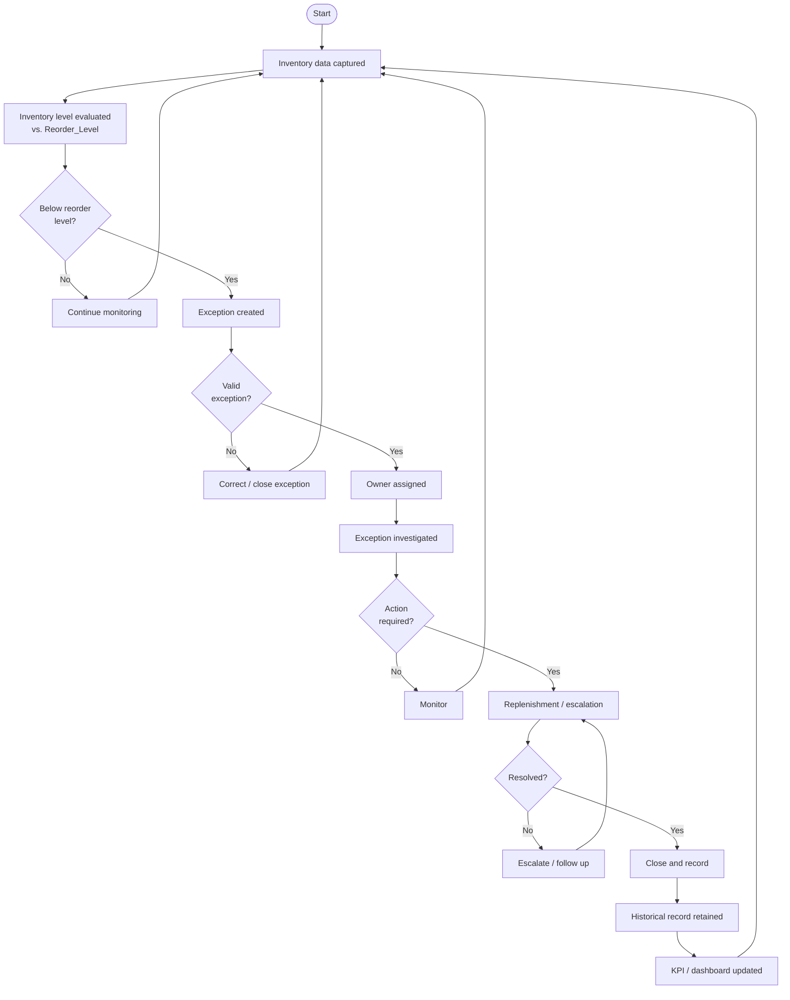

# To-Be Process Design — Inventory Exception Monitoring & Management

**Status:** Phase 11 — To-Be Process Design
**Builds on:** Phases 6–10. This process does **not** depend on an unproven root cause — Phase 9 found no statistically confirmed category, city, or lead-time driver. It is designed to solve the **visibility and monitoring gaps** the As-Is analysis (Phase 10) actually found evidence for.

---

## 11.1 To-Be Process Objective

**Problem it solves:** today, below-reorder-level transactions (1.62% of all sales) are, at best, reviewed periodically and manually (Phase 10, assumed) with no confirmed logging, ownership, or historical tracking. The To-Be process replaces that with a structured exception lifecycle.

**Who benefits:** the Inventory Manager (primary owner), Procurement (replenishment decisions), Operations Manager (escalation visibility), and ultimately the Business Sponsor, who gains a consistent, auditable view instead of an assumed ad hoc process.

**What changes from As-Is:** every below-reorder event becomes a tracked record with an owner, a status, and a retained history — rather than an invisible or undocumented occurrence.

**How it improves visibility:** continuous, systematic comparison of Stock_On_Hand against Reorder_Level replaces an assumed periodic/manual check, and every exception is logged rather than possibly going unnoticed.

**How it enables recurring-exception tracking:** by introducing **future-state Product/SKU and Store identifiers** (confirmed missing from the current dataset in Phase 6, DQ-004), the same item/location can finally be tracked across time — something the current dataset structurally cannot do.

**How it supports management decision-making:** the process feeds the KPI framework (Phase 8) and a future dashboard (Phase 23) with a live, structured exception feed instead of a one-time historical analysis.

---

## 11.2 To-Be Process

| Step | Actor/System | Activity | Input | Output | Business Value |
|---|---|---|---|---|---|
| 1. Inventory data captured | POS/inventory system | Record Stock_On_Hand and Reorder_Level with each transaction | Sale event | Inventory snapshot | Foundation data for detection (already exists today) |
| 2. Inventory level evaluated | IT/Data system | Continuously compare snapshot against threshold | Inventory snapshot | Evaluation result | Replaces assumed manual/periodic review |
| 3. Reorder threshold checked | IT/Data system | Apply BR-01 (below-reorder = exception) | Evaluation result | Pass / breach flag | Consistent, rule-based detection |
| 4. Exception identified | IT/Data system (automatic) | Flag any breach | Breach flag | Draft exception | Removes reliance on someone noticing manually |
| 5. Exception logged | IT/Data system | Create a formal exception record (Section 11.6) | Draft exception | Exception ID + record | Enables tracking, reporting, and history |
| 6. Owner assigned | Inventory Manager | Assign responsibility per RACI (11.9) | Logged exception | Assigned exception | Removes ambiguity about who acts |
| 7. Exception investigated | Assigned owner | Determine likely cause, category | Assigned exception | Investigation notes | Builds a real, if still limited, causal picture over time |
| 8. Action determined | Assigned owner / Procurement | Decide replenishment or other action | Investigation notes | Action plan | Structured decision instead of an assumed ad hoc one |
| 9. Replenishment/action completed | Procurement / Supplier | Execute the action | Action plan | Completed action | Closes the operational loop |
| 10. Exception status updated | Assigned owner | Move status through the lifecycle (11.5) | Completed action | Updated status | Real-time visibility into progress |
| 11. Historical record retained | IT/Data system | Archive the closed exception (BR-04) | Closed exception | Historical record | Enables recurring-exception analysis (11.8) |
| 12. KPI/dashboard updated | IT/Data system | Refresh KPI values (Phase 8/11.10) | Historical + live records | Updated dashboard | Keeps management visibility current |

---

## 11.3 To-Be Process Flow

Four decision points, in order: *Below reorder level?* → *Valid exception?* → *Action required?* → *Resolved?* — reproducible in draw.io/Lucidchart/Visio using rectangles for activities and diamonds for these four checks.

---

## 11.4 As-Is vs. To-Be Comparison

| Area | As-Is | To-Be | Improvement |
|---|---|---|---|
| Inventory monitoring | Periodic/manual review (assumed) | Continuous, automated comparison of Stock_On_Hand vs. Reorder_Level | Shrinks the time between a threshold breach and detection |
| Exception identification | Ad hoc, no flagging mechanism evidenced | Systematic, rule-based flagging (BR-01) of every below-reorder transaction | Every qualifying case is captured consistently |
| Alerting | None/manual (assumed) | Automated, prioritized alert (11.7) to the assigned owner | Faster awareness of new exceptions |
| Ownership | Unclear/undefined | Every exception has one assigned owner (BR-02, RACI 11.9) | Removes ambiguity about who acts |
| Investigation | Inconsistent/undocumented | Structured "Under Investigation" status with a recorded root-cause category | Investigation outcomes become visible and comparable |
| Replenishment action | Assumed to happen, untracked | Logged Action Required → In Progress → Resolved stages with timestamps | Replenishment becomes traceable instead of assumed |
| Exception history | Not retained (no such field exists today) | Every closed exception retains a historical record (BR-04) | Enables trend analysis over time |
| Recurring exception tracking | **Not possible** — no persistent Product/SKU or Store ID (Phase 6, DQ-004) | Enabled once future-state Product/SKU and Store IDs exist (BR-05) | Distinguishes one-off exceptions from systemic ones |
| Reporting | Fragmented/ad hoc (assumed) | Centralized KPI/dashboard updated with each exception | Single source of truth for management |
| KPI visibility | Not confirmed as monitored today | Defined KPI set (11.10) tracked on an ongoing basis | Direct line from Phase 8's KPI framework into daily operations |
| Management escalation | No escalation path evidenced | Unresolved exceptions past an agreed window escalate to the Operations Manager (BR-06) | Prevents high-priority items from stalling indefinitely |

---

## 11.5 Exception Management Model (Lifecycle)

**Detected → Open → Assigned → Under Investigation → Action Required → In Progress → Resolved → Closed**

| Status | Who Changes It | What Triggers It | What Must Be Recorded |
|---|---|---|---|
| Detected | System (automatic) | Stock_On_Hand < Reorder_Level | Timestamp, category, city, channel, current inventory, reorder level |
| Open | System (automatic) | A formal exception record is created | Exception ID |
| Assigned | Inventory Manager | Manual assignment | Assigned owner, assignment timestamp |
| Under Investigation | Assigned owner | Owner begins review | Investigation notes, root-cause category (if identified) |
| Action Required | Assigned owner | Investigation concludes action is needed | Proposed action, approver |
| In Progress | Procurement / Supplier | Action approved and started | Action start timestamp |
| Resolved | Assigned owner | Action completed | Resolution timestamp, resolution notes |
| Closed | Inventory Manager | Final review/sign-off | Closure timestamp, final outcome, recurrence flag |

**If an exception remains unresolved** beyond an agreed response window (a threshold to be set with stakeholders — see BR-06), it automatically escalates to the Operations Manager per the RACI in 11.9, rather than remaining indefinitely open with no visibility.

---

## 11.6 Exception Record

| Field | Purpose | Required? |
|---|---|---|
| Exception ID | Unique identifier for tracking | Yes |
| Date/time detected | When the exception was identified | Yes |
| Product/SKU ID | Identify the specific product affected | Yes — **future-state data requirement; does not exist in the current dataset** |
| Store ID | Identify the specific store/location affected | Yes — **future-state data requirement; does not exist in the current dataset** |
| Category | Product category | Yes (available today) |
| City | Store location | Yes (available today) |
| Channel | Online / Offline / Omnichannel | Yes (available today) |
| Current inventory | Stock_On_Hand at detection | Yes (available today) |
| Reorder level | Reorder_Level at detection | Yes (available today) |
| Inventory gap | Reorder_Level − Stock_On_Hand | Yes (derived from today's fields) |
| Assigned owner | Who is responsible for resolving it | Yes |
| Priority | Low / Medium / High / Critical (11.7) | Yes |
| Status | Current lifecycle status (11.5) | Yes |
| Root-cause category | Classification once investigated | No — populated only after investigation |
| Action taken | What was done to resolve it | Yes, once resolved |
| Resolution date | When it was resolved | Yes, once resolved |
| Resolution time | Duration from detection to resolution | Yes, once resolved (derived) |
| Recurrence indicator | Flags whether this Product/SKU + Store has a prior exception | Yes — **also depends on the future-state Product/SKU + Store ID above** |

---

## 11.7 Alerting Requirements

**Proposed business rules — priority bands and response windows require stakeholder validation.**

- **Trigger:** an exception enters "Detected" status (Stock_On_Hand < Reorder_Level).
- **Recipient:** the assigned owner (default: Inventory Manager) per the RACI in 11.9.
- **Priority model:**
  | Priority | Suggested Criterion (proposed, not validated) |
  |---|---|
  | Low | Inventory gap is small relative to Reorder_Level |
  | Medium | Standard below-reorder occurrence, no other factor present |
  | High | Recurring exception at the same (future-state) Product/SKU + Store |
  | Critical | Recurring exception combined with a large inventory gap |
- **Escalation rule:** an exception open beyond an agreed response window (BR-06) escalates one level and notifies the Operations Manager.
- **Alert closure:** when the exception reaches "Resolved" status; the record itself only closes at "Closed" after sign-off.

The specific numeric thresholds above (what counts as "small" vs "large" gap, how many days define the response window) are **proposed placeholders requiring stakeholder validation** — not values derived from this dataset.

---

## 11.8 Recurring Exception Tracking

This directly addresses the data-backed gap from Phase 10: **the current dataset has no persistent Product/SKU or Store ID**, so recurrence cannot be measured today.

**Proposed future-state key:** Product/SKU ID + Store ID + Date/Time + Exception history

Once this key exists, historical exception records could identify:
- **Repeated exceptions** — the same Product/SKU + Store falling below reorder level more than once
- **Frequently affected products** — a Product/SKU appearing across many stores' exception histories
- **Frequently affected stores** — a Store ID appearing across many products' exception histories
- **Repeated category/channel patterns** — e.g., confirming (or disproving) whether Dairy or Online genuinely recurs as a pattern once real history accumulates, rather than relying on the single-year snapshot used in Phase 9
- **Persistent operational issues** — cases where the same combination recurs repeatedly despite prior resolution, suggesting an unaddressed underlying cause

**This entire capability is explicitly future-state** — it requires both the new identifiers (11.6, 11.12) and enough accumulated history to distinguish a real pattern from noise (the same statistical caution applied in Phase 9 would need to be reapplied once this data exists).

---

## 11.9 To-Be RACI

**Proposed responsibility model requiring stakeholder validation.** R = Responsible, A = Accountable, C = Consulted, I = Informed

| Activity | Operations/Store Staff | Inventory Manager | Procurement | Operations Manager | IT/Data Team |
|---|---|---|---|---|---|
| Monitor inventory | R | A | I | I | R |
| Review exception | I | A/R | C | I | I |
| Assign exception | I | A/R | I | I | I |
| Investigate | C | A/R | C | I | I |
| Approve action | I | C | A/R | I | I |
| Replenish | R | I | A | I | I |
| Resolve | R | A | C | I | I |
| Escalate | I | R | C | A | I |
| Review KPI | I | C | C | A | R |

---

## 11.10 To-Be KPIs

| KPI | Definition | Formula | Target | Data Required | Owner |
|---|---|---|---|---|---|
| Below-Reorder-Level Rate | Share of transactions below reorder threshold | COUNT(Stock_On_Hand<Reorder_Level) ÷ COUNT(*) | Business target to be established with stakeholders | Available today | Inventory Manager |
| Inventory Exception Rate | Share of transactions formally logged as exceptions | COUNT(Exceptions) ÷ COUNT(*) | Business target to be established with stakeholders | Future-state exception log | Inventory Manager |
| Exception Response Time | Time from detection to owner assignment | Assignment timestamp − Detection timestamp | Business target to be established with stakeholders | Future-state timestamps | Inventory Manager |
| Exception Resolution Time | Time from detection to resolution | Resolution timestamp − Detection timestamp | Business target to be established with stakeholders | Future-state timestamps | Inventory Manager |
| Recurring Exception Rate | Share of exceptions that repeat for the same product/store | Requires Product/SKU + Store history | Business target to be established with stakeholders | Future-state Product/SKU + Store ID | Inventory Manager |
| Stockout Rate | Share of transactions/time with zero stock | COUNT(Stock_On_Hand=0) ÷ COUNT(*) | Business target to be established with stakeholders | Available today (currently always >0) | Inventory Manager |
| Inventory Availability Rate | Inverse of Below-Reorder-Level Rate | 1 − Below-Reorder-Level Rate | Business target to be established with stakeholders | Available today | Inventory Manager |
| Open Exception Aging | Average time exceptions remain open | AVG(Now − Detection date) for open exceptions | Business target to be established with stakeholders | Future-state timestamps | Operations Manager |

---

## 11.11 Business Rules

| ID | Rule | Status |
|---|---|---|
| BR-01 | An inventory record below its defined reorder level should generate an exception | Proposed — detection logic |
| BR-02 | Every exception should have an assigned owner | Proposed — accountability |
| BR-03 | Every exception should have a status at all times | Proposed — lifecycle integrity |
| BR-04 | Resolved exceptions should retain their historical record | Proposed — enables 11.8 |
| BR-05 | Repeated exceptions should be identifiable using persistent Product/SKU and Store IDs | Proposed — depends on future-state data (11.6, 11.12) |
| BR-06 | Unresolved exceptions exceeding an agreed response period should be escalated | Proposed — the specific response period **requires stakeholder validation** |

All six are **proposed rules**; none reflect a confirmed existing RetailCo policy.

---

## 11.12 Data Requirements

| Data Element | Current Availability | Future Requirement | Purpose |
|---|---|---|---|
| Product/SKU ID | **Not available** | Persistent unique identifier per product | Per-product tracking and recurrence analysis |
| Store ID | **Not available** | Persistent unique identifier per store/location | Per-location tracking and recurrence analysis |
| Inventory level | Available (Stock_On_Hand) | Ideally a running balance, not just a transaction-linked snapshot | Core input for exception detection |
| Reorder level | Available (Reorder_Level) | Continue capturing; confirm calibration with stakeholders (raised in Phase 10) | Threshold for exception detection |
| Timestamp | Available at transaction level (Invoice_Date) | Add separate detection / assignment / resolution timestamps | Enables response and resolution-time KPIs |
| Channel | Available | Continue capturing | Segmentation (modest signal found in Phase 9) |
| Category | Available | Continue capturing | Segmentation |
| Location (City) | Available | Continue capturing; consider store-level granularity via Store ID | Targeted monitoring |
| Exception status | **Not available** | New field: lifecycle status (11.5) | Tracks where each exception stands |
| Exception owner | **Not available** | New field: assigned person/role | Ownership and RACI accountability |
| Action | **Not available** | New field: action type/notes | Root-cause categorization over time |
| Resolution timestamp | **Not available** | New field | Resolution-time KPIs |
| Historical exception ID | **Not available** | New field linking related/recurring exceptions | Recurring Exception Rate (11.8) |

---

## 11.13 Expected Business Value

- Expected to improve early visibility of inventory exceptions, replacing an assumed periodic/manual check with continuous monitoring.
- Expected to improve exception ownership by assigning every exception to a named role rather than leaving responsibility undefined.
- Expected to improve investigation consistency through a structured status and root-cause category.
- Expected to improve historical tracking by retaining every closed exception, which the current dataset structure cannot do.
- Expected to improve management reporting by feeding the Phase 8 KPI framework continuously rather than through a one-time analysis.
- Expected to enable identification of recurring issues once future-state Product/SKU and Store identifiers exist.
- Expected to improve consistency of monitoring across categories and cities.
- Expected to improve decision support for the Inventory and Procurement Managers.

No specific percentage improvement is claimed anywhere above — these are qualitative, directional expectations only.

---

## 11.14 Final To-Be Conclusion

1. The To-Be process does **not** depend on an unproven root cause — it was designed around the confirmed visibility and monitoring gaps from Phase 10, not the unconfirmed Dairy/Mumbai or Snacks/Chennai patterns from Phase 9.
2. It directly addresses the gaps validated earlier: no automated detection, no ownership, no history, no recurring-exception tracking.
3. It introduces structured exception ownership and full lifecycle management (Detected → Closed) in place of an assumed, undocumented process.
4. It enables future recurring-exception analysis specifically through the persistent Product/SKU and Store identifiers this project confirmed are currently missing (Phase 6, DQ-004).
5. It creates the foundation for the next phase — **Requirements Engineering** — where these process steps, business rules, and data requirements translate into formal Business and Functional Requirements.

---

**Next step:** Phase 12 — Business Requirements Document / Requirements Engineering, translating this To-Be design into formal BR/FR/NFR/User Stories.
