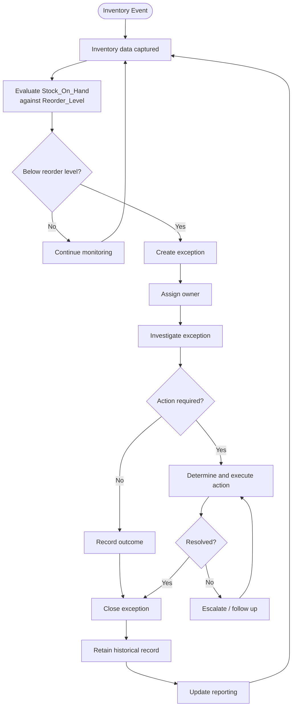

# To-Be Process Design — Inventory Exception Monitoring & Management

**Status:** Phase 11 — To-Be Process Design
**Builds on:** Phases 6–10

> **Design boundary:** This To-Be process is a proposed future-state design. It is not presented as an existing RetailCo process or an implemented solution. The current dataset confirms transaction-level below-reorder observations and structural data limitations, but it does not provide enough evidence to reconstruct the actual operational workflow, ownership model, alerting process, or replenishment procedure.

The design therefore focuses on the evidence-supported opportunity identified through the case study: **improving inventory exception visibility, ownership, tracking, and decision support**.

---

## 11.1 To-Be Process Objective

### Business Problem Addressed

The 2024 dataset contains **1,624 transaction records below the defined reorder level (1.62%)**. However, the available data does not contain persistent Product/SKU and Store identifiers, exception records, ownership information, resolution timestamps, or historical inventory movements.

Therefore, the current dataset cannot support recurring-exception tracking or end-to-end operational monitoring.

The To-Be process proposes a structured exception-management lifecycle that converts a detected below-reorder condition into a trackable business record.

### What the To-Be Process Changes

| Area                     | Proposed Future State                                                              |
| ------------------------ | ---------------------------------------------------------------------------------- |
| Detection                | Systematically evaluate inventory level against reorder level                      |
| Exception identification | Create an exception when the defined business rule is breached                     |
| Ownership                | Assign each exception to a responsible role                                        |
| Investigation            | Record investigation and cause classification                                      |
| Action                   | Record replenishment or another approved response                                  |
| Escalation               | Escalate unresolved exceptions according to an agreed response window              |
| History                  | Retain closed exceptions for future analysis                                       |
| Recurrence               | Identify repeated Product/SKU + Store exceptions once persistent identifiers exist |
| Reporting                | Feed structured exception data into management reporting and dashboards            |

### Important Boundary

The current dataset supports only **transaction-level detection**. A production implementation would require additional system capabilities and persistent inventory data.

The To-Be design therefore represents a **proposed business process and information model**, not a claim that these capabilities currently exist.

---

## 11.2 To-Be Process

| Step                              | Actor/System                            | Activity                                                   | Input                       | Output                 | Business Value                                                        |
| --------------------------------- | --------------------------------------- | ---------------------------------------------------------- | --------------------------- | ---------------------- | --------------------------------------------------------------------- |
| 1. Inventory data captured        | Inventory/POS system                    | Capture inventory level and reorder threshold              | Inventory transaction/event | Inventory record       | Provides the information required for detection                       |
| 2. Inventory level evaluated      | Inventory monitoring system             | Compare Stock_On_Hand against Reorder_Level                | Inventory record            | Evaluation result      | Creates consistent detection logic                                    |
| 3. Reorder threshold checked      | System                                  | Apply BR-01                                                | Evaluation result           | Pass / breach result   | Standardizes exception identification                                 |
| 4. Exception identified           | System                                  | Create an exception when the rule is breached              | Breach result               | Exception record       | Prevents qualifying events from being dependent on manual recognition |
| 5. Exception logged               | System                                  | Generate unique exception record                           | Detected event              | Exception ID           | Enables tracking and audit history                                    |
| 6. Owner assigned                 | Inventory Manager                       | Assign responsible role                                    | Exception record            | Assigned exception     | Establishes accountability                                            |
| 7. Exception investigated         | Assigned owner                          | Review available information and determine likely cause    | Assigned exception          | Investigation record   | Builds structured operational knowledge                               |
| 8. Action determined              | Inventory Manager / Procurement         | Decide whether replenishment or another action is required | Investigation record        | Action decision        | Creates a consistent decision point                                   |
| 9. Action executed                | Procurement / relevant operational role | Execute approved action                                    | Action decision             | Action result          | Moves the exception toward resolution                                 |
| 10. Status updated                | Assigned owner                          | Update lifecycle status                                    | Action result               | Updated exception      | Maintains current visibility                                          |
| 11. Exception closed and retained | Inventory Manager / System              | Confirm resolution and retain record                       | Resolved exception          | Historical exception   | Enables future trend and recurrence analysis                          |
| 12. Reporting updated             | System / BI or Data Team                | Refresh exception and KPI reporting                        | Exception history           | Management information | Supports ongoing decision-making                                      |

**Future-state capability:** Steps 2–5 may be automated by an inventory monitoring solution. The exact implementation technology is outside the scope of this case study.

---

## 11.3 To-Be Process Flow

### Key Decision Points

1. **Below reorder level?**
2. **Is action required?**
3. **Has the exception been resolved?**

These decision points should be validated with stakeholders before implementation.

---

## 11.4 As-Is vs. To-Be Comparison

| Area                     | Current Evidence / Limitation                                                                                       | To-Be Design                                                   | Intended Improvement                                   |
| ------------------------ | ------------------------------------------------------------------------------------------------------------------- | -------------------------------------------------------------- | ------------------------------------------------------ |
| Inventory monitoring     | Transaction-level inventory fields are available, but the actual operational monitoring process is not evidenced    | Systematically evaluate inventory level against reorder level  | Consistent detection                                   |
| Exception identification | Below-reorder observations can be calculated analytically, but no exception-management record exists in the dataset | Create a formal exception record                               | Traceability                                           |
| Alerting                 | No alert mechanism is evidenced in the available dataset                                                            | Introduce configurable notifications for qualifying exceptions | Faster awareness                                       |
| Ownership                | Ownership cannot be established from the dataset                                                                    | Assign an accountable role to each exception                   | Clear accountability                                   |
| Investigation            | Investigation process is not evidenced                                                                              | Record investigation status, notes, and cause classification   | Structured investigation                               |
| Replenishment/action     | Actual operational procedure is not evidenced                                                                       | Record the approved action and its progress                    | Traceable action                                       |
| Exception history        | No historical exception log is available                                                                            | Retain closed exception records                                | Historical visibility                                  |
| Recurrence tracking      | Not possible with current Product/SKU and Store data                                                                | Enable recurrence analysis once persistent identifiers exist   | Identify repeated issues                               |
| Reporting                | The dataset supports retrospective analysis, but ongoing operational reporting is not evidenced                     | Provide structured exception reporting/dashboarding            | Ongoing decision support                               |
| Escalation               | No current escalation procedure is evidenced                                                                        | Introduce an agreed escalation rule                            | Prevent unresolved exceptions from remaining invisible |

**Important:** “Not evidenced” does not mean the capability definitely does not exist at RetailCo. It means the available case-study data cannot establish that it exists.

---

## 11.5 Exception Management Lifecycle

**Detected → Open → Assigned → Under Investigation → Action Required → In Progress → Resolved → Closed**

| Status              | Who Changes It                        | Trigger                                     | Information Recorded                                |
| ------------------- | ------------------------------------- | ------------------------------------------- | --------------------------------------------------- |
| Detected            | System                                | Stock_On_Hand < Reorder_Level               | Detection timestamp, inventory level, reorder level |
| Open                | System                                | Exception record created                    | Exception ID                                        |
| Assigned            | Inventory Manager                     | Responsible role assigned                   | Owner, assignment timestamp                         |
| Under Investigation | Assigned owner                        | Investigation begins                        | Investigation notes, cause category if identified   |
| Action Required     | Assigned owner                        | Investigation determines action is required | Proposed action, approval                           |
| In Progress         | Relevant operational/procurement role | Approved action begins                      | Action start timestamp                              |
| Resolved            | Assigned owner                        | Action completed / issue addressed          | Resolution notes, resolution timestamp              |
| Closed              | Inventory Manager                     | Final review completed                      | Closure timestamp, final outcome                    |

### Escalation

If an exception remains unresolved beyond an agreed response window, it should be escalated according to the approved future-state escalation rule.

The response window is **not defined by the current dataset** and must be established through stakeholder validation.

---

## 11.6 Exception Record

| Field                | Purpose                                            | Required?                      |
| -------------------- | -------------------------------------------------- | ------------------------------ |
| Exception ID         | Unique identifier for tracking                     | Yes                            |
| Detection date/time  | Identifies when the exception was detected         | Yes                            |
| Product/SKU ID       | Identifies the affected product                    | Yes — future-state requirement |
| Store ID             | Identifies the affected location                   | Yes — future-state requirement |
| Category             | Product category                                   | Yes                            |
| City                 | Geographic location                                | Yes                            |
| Channel              | Sales channel                                      | Yes                            |
| Stock_On_Hand        | Inventory level at detection                       | Yes                            |
| Reorder_Level        | Threshold used for detection                       | Yes                            |
| Inventory Gap        | Reorder_Level − Stock_On_Hand                      | Yes — derived                  |
| Assigned Owner       | Responsible role/person                            | Yes                            |
| Priority             | Operational priority                               | Yes                            |
| Status               | Current lifecycle state                            | Yes                            |
| Root-Cause Category  | Classification after investigation                 | No — populated when identified |
| Action Taken         | Response/action performed                          | Required when action occurs    |
| Resolution Date/Time | Completion time                                    | Required when resolved         |
| Resolution Time      | Detection-to-resolution duration                   | Derived                        |
| Recurrence Indicator | Identifies repeated Product/SKU + Store exceptions | Future-state requirement       |

The Product/SKU and Store fields are deliberately identified as **future-state requirements** because the current dataset does not provide persistent identifiers.

---

## 11.7 Alerting Requirements

The following are **proposed requirements for stakeholder validation**, not existing RetailCo policies.

### Trigger

An alert should be generated when an inventory record satisfies:

**Stock_On_Hand < Reorder_Level**

### Recipient

The initial recipient should be the role assigned responsibility for inventory exception management, proposed as the **Inventory Manager**.

### Proposed Priority Model

| Priority | Proposed Logic                                                               |
| -------- | ---------------------------------------------------------------------------- |
| Low      | Small inventory gap with no additional priority factors                      |
| Medium   | Standard below-reorder exception                                             |
| High     | Repeated exception for the same future-state Product/SKU + Store             |
| Critical | Repeated exception combined with an agreed high-severity inventory condition |

The exact numeric thresholds for priority classification must be defined and approved by stakeholders.

### Escalation

An unresolved exception should be escalated when it exceeds an agreed response window.

The response window and escalation hierarchy require stakeholder validation.

---

## 11.8 Recurring Exception Tracking

The current dataset cannot reliably measure recurrence because it lacks persistent **Product/SKU ID** and **Store ID**.

The proposed future-state tracking key is:

**Product/SKU ID + Store ID + Exception Date/Time + Exception History**

Once these data elements are available, the organization could identify:

* Repeated exceptions for the same product and store
* Products repeatedly affected across locations
* Stores repeatedly affected across products
* Recurring category or channel patterns
* Exceptions that remain unresolved or repeatedly reappear
* Potential systemic operational issues requiring further investigation

Any future recurrence analysis should continue the evidence-based approach used in Phase 9. A repeated observation should be treated as a signal requiring analysis rather than automatically classified as a root cause.

---

## 11.9 To-Be RACI

**Proposed responsibility model — requires stakeholder validation.**

**R = Responsible | A = Accountable | C = Consulted | I = Informed**

| Activity                      | Store / Operations Staff | Inventory Manager | Procurement | Operations Manager | IT / Data Team |
| ----------------------------- | ------------------------ | ----------------- | ----------- | ------------------ | -------------- |
| Monitor inventory exceptions  | C                        | A                 | I           | I                  | R              |
| Review exception              | I                        | A/R               | C           | I                  | C              |
| Assign exception              | I                        | A/R               | I           | I                  | I              |
| Investigate exception         | C                        | A/R               | C           | I                  | C              |
| Approve replenishment/action  | I                        | A                 | R           | I                  | I              |
| Execute replenishment/action  | R                        | I                 | A/R         | I                  | I              |
| Confirm resolution            | R                        | A                 | C           | I                  | I              |
| Escalate unresolved exception | I                        | R                 | C           | A                  | I              |
| Review KPI/reporting          | I                        | C                 | C           | A                  | R              |

This RACI is a **proposed future-state governance model**, not evidence of current RetailCo responsibilities.

---

## 11.10 To-Be KPIs

The To-Be process should extend the KPI framework from Phase 8 with operational exception-management measures.

| KPI                       | Definition                                                      | Formula                                             | Target        | Data Required                      | Proposed Owner     |
| ------------------------- | --------------------------------------------------------------- | --------------------------------------------------- | ------------- | ---------------------------------- | ------------------ |
| Below-Reorder-Level Rate  | Share of inventory observations below reorder level             | COUNT(Stock_On_Hand < Reorder_Level) ÷ COUNT(*)     | To be defined | Available today                    | Inventory Manager  |
| Exception Logging Rate    | Share of qualifying below-reorder events formally logged        | COUNT(Logged Exceptions) ÷ COUNT(Qualifying Events) | To be defined | Future exception log               | Inventory Manager  |
| Exception Response Time   | Time from detection to owner assignment                         | Assignment Time − Detection Time                    | To be defined | Future timestamps                  | Inventory Manager  |
| Exception Resolution Time | Time from detection to resolution                               | Resolution Time − Detection Time                    | To be defined | Future timestamps                  | Inventory Manager  |
| Recurring Exception Rate  | Share of exceptions that recur for the same Product/SKU + Store | Recurring Exceptions ÷ Total Exceptions             | To be defined | Future Product/SKU + Store history | Inventory Manager  |
| Open Exception Aging      | Time unresolved exceptions remain open                          | Current Time − Detection Time                       | To be defined | Future lifecycle timestamps        | Operations Manager |

### KPI Boundary

The existing **1.62% Below-Reorder-Level Rate** is a transaction-level descriptive measure.

It should **not** be interpreted as:

* stockout rate,
* product shortage rate,
* store availability rate, or
* inventory availability percentage.

A true availability KPI would require an appropriate operational definition and supporting inventory/time data.

---

## 11.11 Business Rules

| ID    | Rule                                                                                          | Status                                                     |
| ----- | --------------------------------------------------------------------------------------------- | ---------------------------------------------------------- |
| BR-01 | An inventory observation below its defined reorder level should generate an exception         | Proposed                                                   |
| BR-02 | Every exception should have an assigned responsible role                                      | Proposed                                                   |
| BR-03 | Every exception should have a valid lifecycle status                                          | Proposed                                                   |
| BR-04 | Closed exceptions should be retained as historical records                                    | Proposed                                                   |
| BR-05 | Repeated exceptions should be identifiable using persistent Product/SKU and Store identifiers | Proposed — future-state dependency                         |
| BR-06 | Exceptions exceeding an agreed response period should be escalated                            | Proposed — response period requires stakeholder validation |
| BR-07 | Exception priority should be determined using approved business rules                         | Proposed — thresholds require stakeholder validation       |

All business rules above are **future-state proposals**. None should be presented as confirmed existing RetailCo policy.

---

## 11.12 Data Requirements

| Data Element         | Current Availability                | Future Requirement                                                              | Purpose                               |
| -------------------- | ----------------------------------- | ------------------------------------------------------------------------------- | ------------------------------------- |
| Product/SKU ID       | Not available                       | Persistent unique product identifier                                            | Product-level tracking and recurrence |
| Store ID             | Not available                       | Persistent store/location identifier                                            | Store-level tracking and recurrence   |
| Stock_On_Hand        | Available                           | Prefer reliable inventory balance rather than transaction-linked snapshot alone | Exception detection                   |
| Reorder_Level        | Available                           | Continue capturing and validate business calibration                            | Detection threshold                   |
| Transaction Date     | Available                           | Retain                                                                          | Historical analysis                   |
| Detection Timestamp  | Not available as an exception event | Create separate timestamp                                                       | Response-time measurement             |
| Assignment Timestamp | Not available                       | Create                                                                          | Response-time measurement             |
| Channel              | Available                           | Continue capturing                                                              | Segmentation                          |
| Category             | Available                           | Continue capturing                                                              | Segmentation                          |
| City                 | Available                           | Continue capturing; complement with Store ID                                    | Geographic monitoring                 |
| Exception ID         | Not available                       | Generate unique identifier                                                      | Exception tracking                    |
| Exception Status     | Not available                       | Create lifecycle field                                                          | Exception management                  |
| Exception Owner      | Not available                       | Create responsible role/person field                                            | Accountability                        |
| Investigation Notes  | Not available                       | Create                                                                          | Investigation history                 |
| Root-Cause Category  | Not available                       | Create controlled classification                                                | Recurring analysis                    |
| Action Taken         | Not available                       | Create                                                                          | Action tracking                       |
| Resolution Timestamp | Not available                       | Create                                                                          | Resolution KPI                        |
| Closure Timestamp    | Not available                       | Create                                                                          | Lifecycle management                  |
| Recurrence Indicator | Not available                       | Derive using Product/SKU + Store history                                        | Recurrence analysis                   |

---

## 11.13 Expected Business Value

The proposed To-Be process is expected to provide the following qualitative benefits:

* **Improved visibility** by creating a structured exception record for qualifying inventory observations.
* **Clearer accountability** by assigning each exception to a responsible role.
* **Better traceability** through lifecycle statuses and timestamps.
* **More consistent investigation** through structured notes and cause categories.
* **Historical visibility** through retention of closed exceptions.
* **Future recurrence analysis** once persistent Product/SKU and Store identifiers are available.
* **Improved management reporting** through structured operational data that can feed future dashboards and KPI reporting.
* **Better decision support** for inventory and procurement management.

These are **expected benefits of the proposed design**, not measured business outcomes. No implementation results or percentage improvements are claimed.

---

## 11.14 Design Assumptions and Validation Needs

Before implementation, the following items require stakeholder validation:

1. Whether Stock_On_Hand is sufficiently current for operational detection.
2. The authoritative source for inventory and reorder-level data.
3. Who owns inventory exceptions.
4. The approved escalation hierarchy.
5. Response and resolution targets.
6. Priority definitions and severity thresholds.
7. Whether Product/SKU and Store identifiers can be introduced.
8. The approved root-cause classification structure.
9. Whether replenishment requires separate approval.
10. Which KPIs should appear in management reporting.
11. Required dashboard/reporting frequency.
12. Data retention and audit requirements.

These items are deliberately left open rather than invented.

---

## 11.15 Final To-Be Conclusion

The proposed To-Be process translates the evidence from the case study into a structured future-state inventory exception-management model.

The design does **not** assume that Dairy/Mumbai, Snacks/Chennai, supplier lead time, or any other factor identified in Phase 9 is a confirmed root cause. Instead, it addresses the more defensible opportunity identified from the available evidence:

**detect → record → assign → investigate → act → resolve → retain → analyze**

The design also makes the current data limitations explicit. Persistent Product/SKU and Store identifiers, exception history, ownership, timestamps, and operational action data are required before the organization could reliably measure recurring exceptions and operational response performance.

The To-Be process therefore provides the bridge between **analysis and requirements engineering**.

### Evidence-to-Design Chain

**Business Concern → Business Questions → Data Quality → Analysis → Evidence-Based Finding → As-Is Limitations → To-Be Design → Business Rules → Data Requirements → Formal Requirements**

---

**Next step:** Phase 12 — Requirements Engineering, where the To-Be process will be translated into formal **Business Requirements, Functional Requirements, Non-Functional Requirements, acceptance criteria, and traceability**.
